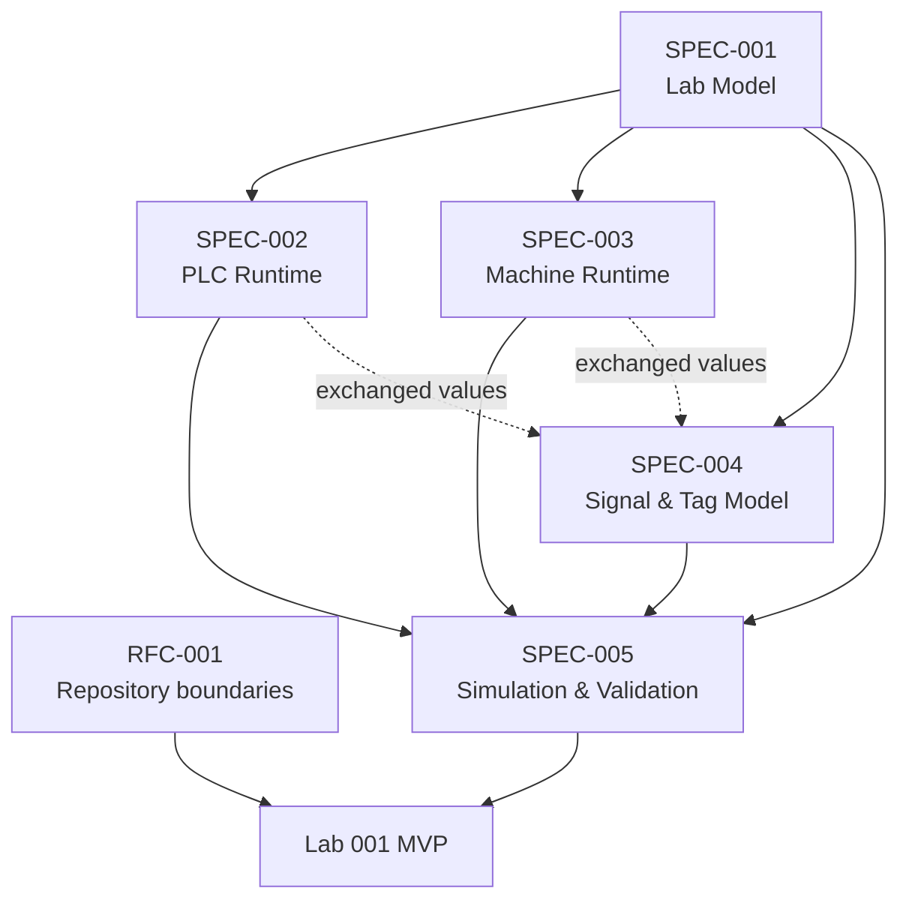

# Digital2Real Academy — MVP Architecture Review and Implementation Handoff

**Status:** Implementation handoff
**Review date:** 2026-07-20
**Target:** Lab 001 — Start/Stop Conveyor
**Reviewed authorities:** RFC-001, PROJECT_STATUS, and SPEC-001 through SPEC-005
**Implementation performed:** None

---

# 1. Executive Conclusion

## Ready with minor clarifications

SPEC-001 through SPEC-005 form a coherent and sufficiently complete behavioral foundation for the first headless Digital2Real Academy vertical slice.

The approved model consistently establishes:

- one canonical Lab Definition;
- independent PLC and Machine Runtimes;
- Signal-only communication with single ownership;
- one fixed-step coordinated Simulation tick;
- next-tick PLC visibility of Machine consequences;
- observer-only automatic Validation;
- deterministic Reset, Events, Diagnostics, and Results;
- a bounded Lab 001 scenario.

No broad specification is missing. Implementation may begin after four bounded handoff conditions are resolved:

1. approve a minimal learner Program representation;
2. accept exact Lab 001 timing defaults;
3. confirm the hidden Emergency-test policy;
4. resolve the existing merge-conflict markers in `docs/PROJECT_STATUS.md` through a separately approved documentation change.

Attempt-summary retention and hint/attempt penalties can use SPEC-005 recommendations or remain disabled initially; they do not block the core runtime.

No approved specification requires a broad amendment before implementation. Two timing/event details should be recorded as targeted conformance notes in the first implementation package rather than reopening the specification phase.

---

# 2. Specification Responsibility Map

| Authority | Canonical responsibility | Major concepts owned |
|---|---|---|
| RFC-001 — Repository Architecture | Repository and dependency boundaries | `Frontend/` remains the deployable root; Academy belongs under `Frontend/products/academy/`; product/shared import rules |
| SPEC-001 — Lab Model | Definition of a Lab | Metadata, Objectives, Machine and PLC declarations, Variables, Challenge, Validation intent, Resources, Progress linkage |
| SPEC-002 — PLC Runtime | Virtual controller behavior | PLC Memory, ordered Programs, scan cycle, Inputs, Outputs, Timers, Counters, controller Events and Diagnostics |
| SPEC-003 — Machine Runtime | Simulated industrial Machine behavior | Components, Physics, committed Machine State, objects, Sensors, actuators, Machine faults and Events |
| SPEC-004 — Signal & Tag Model | Cross-subsystem information contract | Signal identity, Type, Owner, value, Quality, Timestamp, Namespace, Events, mappings and relationships |
| SPEC-005 — Simulation & Validation | MVP orchestration and assessment | Controller lifecycle, Clock, tick order, initialization, full Reset, Validation rules, score, Event History, Diagnostics and Simulation Result |
| PROJECT_STATUS | Live delivery status | Current phase, work status, technical debt and Product decisions; currently invalid because conflict markers remain |

## 2.1 Single Source of Truth by concept

| Concept | SSOT |
|---|---|
| What constitutes a Lab | SPEC-001 |
| Objective categories and Lab-level content | SPEC-001 |
| PLC scan and Memory semantics | SPEC-002 |
| Timer and Counter behavior | SPEC-002 |
| Machine Component, Physics, State and Sensor semantics | SPEC-003 |
| Signal identity, ownership, Type, Quality and mapping | SPEC-004 |
| Simulation lifecycle and fixed-step orchestration | SPEC-005 |
| Validation checkpoint, rule State, scoring and completion | SPEC-005 |
| Repository location and dependency direction | RFC-001 |
| Live implementation status | PROJECT_STATUS after its conflict is resolved |

Lower-level specifications specialize higher-level concepts without replacing them. SPEC-005 coordinates SPEC-002 through SPEC-004; it does not acquire their State ownership.

---

# 3. Dependency Graph



## 3.1 Circular dependencies

No semantic circular dependency is required.

- SPEC-002 and SPEC-003 depend on SPEC-004 only for external exchange, not for internal execution.
- SPEC-004 describes PLC and Machine ownership by reference but does not execute either runtime.
- SPEC-005 depends on all four prior specifications and provides orchestration; prior specifications do not depend on its implementation.

The dashed graph edges represent contracts, not module imports. Implementation MUST keep runtime modules independent and inject Signal snapshots or Registry access through public boundaries.

## 3.2 Hidden dependencies

| Hidden dependency | Status | Required action |
|---|---|---|
| Minimal learner Program representation | Undefined and blocking | Approve a bounded boolean Program data model before PLCRuntime implementation |
| Minimal numeric/time profile | Partially defined | Use Boolean, Enum, non-negative Integer, and fixed millisecond time for Lab 001; defer broad analog semantics |
| Test execution mechanism | Repository has no test framework or package manifest | Evaluate the installed Node built-in test runner with an explicit ES Module command before adding dependencies |
| Resolved project status | PROJECT_STATUS contains conflict markers | Resolve separately before implementation branch/package approval |

## 3.3 Duplicated ownership

No unavoidable duplicated domain ownership was found.

Potential confusion is resolved as follows:

- PLC owns command Outputs; Machine owns physical feedback.
- Subsystems own their local Diagnostics; System owns only cross-platform aggregate Diagnostics.
- Simulation owns shared orchestration time; PLC and Machine receive declared logical intervals.
- Event sources own Event meaning; EventHistory owns the ordered execution record, not the underlying State.
- SignalRegistry owns contract enforcement and accepted Signal state, while the declared subsystem Owner remains the authority for normal updates.

## 3.4 Undefined boundaries

The only implementation-blocking undefined domain boundary is the learner Program representation. The public module contracts, tick boundary, Reset, Signal exchange, Validation access, and terminal Results are otherwise sufficiently defined.

---

# 4. Consistency Review

## 4.1 Consistent areas

The specifications agree on:

- vendor neutrality;
- data-driven definitions;
- single ownership;
- independent PLC and Machine Runtimes;
- Machine-owned Sensors;
- PLC-owned Outputs;
- commands as requests rather than physical State;
- immutable committed snapshots;
- deterministic logical time;
- Validation as observer;
- explicit fault classification;
- Results tied to exact Lab/runtime versions;
- no dependency on UI or rendering speed.

## 4.2 Findings requiring explicit implementation resolution

| ID | Affected authorities | Conflicting or ambiguous concepts | Implementation impact | Recommended resolution |
|---|---|---|---|---|
| C-001 | PROJECT_STATUS variants | Unresolved `HEAD`/`main` conflict markers describe different phases and completed work | Repository is not a trustworthy handoff baseline | Resolve the existing document in a separate approved package before source implementation |
| C-002 | SPEC-002, SPEC-005 | SPEC-002 recommends the first Timer increment normally be zero unless a profile supplies another value; SPEC-005 supplies one fixed interval on the first tick | Timer expectations can differ by one tick | Lab 001 profile explicitly supplies 20 ms to the first PLC scan; add a conformance test |
| C-003 | SPEC-003, SPEC-005 | SPEC-003 defines one Machine update; SPEC-005 names pre-scan and post-scan Machine phases | An implementation might advance Physics twice | Pre-scan performs zero-time boundary reconciliation and Sensor publication; post-scan performs the only Physics advance |
| C-004 | SPEC-004, SPEC-005 | Validation executes in Phase 11 while EventHistory is finalized in Phase 12 | Validation might miss current-tick Events | Stage source Events during phases 2–10, expose the ordered staged tick view to Validation, then commit the final history in Phase 12 |
| C-005 | SPEC-002, SPEC-003, SPEC-004 | Each runtime owns local Diagnostics while SPEC-004 says System owns cross-platform Diagnostics | A System module might overwrite source Diagnostics | Runtime owns local Diagnostic Signals; System may publish separate aggregate/mirror Signals with provenance |
| C-006 | SPEC-002, SPEC-003, SPEC-005 | Lifecycle names overlap and casing differs (`running` versus `Running`) across PLC, Machine, and Controller | One generic status enum could merge distinct domains | Use domain-qualified lifecycle Types: `PLCRuntimeStatus`, `MachineLifecycle`, `SimulationStatus`; representation casing is one implementation convention |
| C-007 | SPEC-002 through SPEC-005 | “Fault” may mean a valid fault Signal value, Fault Quality, modeled Machine Fault, learner Failure, or runtime Fault | Incorrect scoring and terminal State | Preserve five separate concepts and classifications; never infer one from the word alone |
| C-008 | SPEC-004, SPEC-005 | Signal Events are source-owned, while Controller assigns cross-owner ordering | Event ownership could be transferred accidentally | Preserve source Owner/sequence; EventHistory adds tick and phase ordinal only |
| C-009 | SPEC-005 | Full Reset clears active Events but may preserve prior attempt summaries; exact retention is optional | Result and memory bounds vary | MVP retains attempt count and terminal summary only; active attempt EventHistory resets |
| C-010 | SPEC-001, SPEC-004 | SPEC-001 uses Variables broadly; SPEC-004 makes Signal the cross-subsystem SSOT | Internal variables could be exposed accidentally | Variable remains a domain value; only deliberately exchanged Variables receive canonical Signal definitions |
| C-011 | SPEC-004, SPEC-005 | Simulated Machine observations use Simulated Quality; PLC command Signals use Good | Consumers may treat Simulated as inferior/invalid | Lab execution profile accepts Simulated as valid evidence; Quality remains distinguishable from physical Good |
| C-012 | SPEC-002, SPEC-005 | Program execution semantics are defined, but learner Program serialization/loading is absent | PLCRuntime cannot load learner work | Approve the minimal Program model in Blocking Decision B-001 |

## 4.3 Targeted amendment assessment

No specification requires a broad amendment.

- C-002 through C-011 can be captured as conformance decisions and tests in implementation documentation.
- C-012 requires a small approved implementation contract or ADR, not SPEC-006.
- C-001 is a repository-document conflict and must be repaired without altering specification semantics.

---

# 5. Canonical Terminology

| Preferred term | Canonical definition | Avoid or qualify |
|---|---|---|
| Lab Definition | Immutable, versioned SPEC-001 definition of one learning experience | “Lab” when referring only to UI or runtime instance |
| Simulation Controller | Coordinator and lifecycle owner for one execution | “Scheduler” unless referring specifically to tick pacing |
| Simulation Clock | Owner of fixed-step virtual time, tick count and host pacing | System clock, render clock |
| Signal Registry | MVP realization of the SPEC-004 Signal Layer: definitions, accepted states, snapshots, mappings and Signal Events | Shared global state, event bus |
| Signal | Canonical exchanged information contract and value state | Variable when crossing subsystem boundaries |
| Tag | Named reference resolving to one canonical Signal | Duplicate Signal or independent value |
| PLC Runtime | Deterministic virtual controller executing one ordered Program model | Simulator, PLC engine when ownership is ambiguous |
| PLC Scan | Input Update, Program Execution, Output Update and PLC Diagnostics | Simulation tick; they are related but not identical |
| Machine Runtime | Deterministic Component/Physics/State/Event/Sensor runtime | Conveyor runtime; conveyor is only Lab 001’s Machine |
| Machine Component | Identified element with Type, State, Health, Parameters, Connections and lifecycle | Device when the generic capability is intended |
| Validation Engine | Observer that evaluates approved Signals, Events and Simulation time | Test harness when referring to product behavior |
| Validation Rule | Versioned observable condition with trigger, evidence, status and Result | Hardcoded assertion |
| Event | Immutable source-owned observation of a transition or lifecycle occurrence | State; Event does not own current truth |
| Event History | Bounded, ordered per-execution record of Events | Analytics store or persistent event sourcing |
| Fault | Qualified abnormal condition: modeled Machine/PLC fault, Signal Quality fault, configuration fault, or runtime integrity fault | Unqualified “fault” in code/contracts |
| Learner Failure | Trustworthy execution that violates a Lab rule | Runtime Fault |
| Simulation Result | Immutable terminal summary for one execution/attempt | Validation Result alone; it includes more than Validation |

Implementation names SHOULD preserve these distinctions even if local enum values use lower-case serialization.

---

# 6. Runtime Ownership Matrix

| Item | Authoritative owner | Permitted readers | Permitted writers | Forbidden access |
|---|---|---|---|---|
| Simulation time | Simulation Clock | Controller, PLC/Machine public calls, Validation, Diagnostics, observers via Signal | Clock only | UI, PLC, Machine or Validation direct mutation |
| PLC Memory | PLC Runtime | PLC Program; approved Diagnostics/Signals through publication | PLC Runtime/Program according to SPEC-002 | Machine, Validation, UI, Controller direct access |
| PLC Outputs | PLC Runtime | Signal Registry, Machine through mapping, Validation, observers | PLC Runtime at Output Update | Machine or UI writing the Output Signal |
| Machine State | Machine Runtime | Machine Components/Physics; approved observers through Signals | Machine Runtime only | PLC, Validation, UI, Controller direct mutation |
| Sensor values | Machine Runtime | Signal Registry, PLC through next Input snapshot, Validation, observers | Machine Sensor evaluation only | PLC Output or UI direct writes |
| Accepted Signal states | Signal Registry under declared Signal Owner authority | Authorized Destinations | Declared Owner publication boundary | Second owner, direct consumer mutation |
| Validation State | Validation Engine | Controller aggregate query, Result builder, approved Validation Signals | Validation Engine only | PLC, Machine, UI or Controller setting rule outcome |
| Score | Validation Engine | Controller, Result builder, learner view, analytics | Validation Engine only | UI, learner, PLC or Machine writes |
| Event History | EventHistory | Validation, Diagnostics, Result builder, approved observers | EventHistory appends source Events; sources retain Event ownership | Retroactive mutation or runtime State derivation by writing history |
| Local Diagnostics | Producing runtime/module | Controller, System aggregation, Result builder, approved observers | Producing runtime/module | System overwriting source Diagnostics |
| Aggregate Diagnostics | SimulationDiagnostics/System | Controller, Result builder, learner/internal views by policy | Aggregator from source observations | Mutation of underlying runtime state |
| Rendering State | UI component | UI only | UI only | Becoming source for Simulation, PLC, Machine or Validation truth |
| Learner Inputs | User domain through approved command boundary | Signal Registry, PLC mapping, Validation, UI | Authorized learner/test input adapter | Direct PLC Memory, Output or Machine State mutation |

The Simulation Controller coordinates permitted public calls but is not granted implicit write authority over owned State.

---

# 7. Canonical MVP Tick

## 7.1 Final sequence

| Phase | Action | Current-tick visibility | Next-scan effect |
|---:|---|---|---|
| 1 | Advance Clock by fixed step and assign tick identity | New Simulation time is current | PLC receives this tick interval |
| 2 | Apply queued external inputs assigned to this tick | User/safety request Signals become current | Copied to PLC Inputs in Phase 5 when mapped |
| 3 | Reconcile Machine pre-scan boundary without Physics advancement | Prior committed physical State plus scheduled external physical changes | Forms Sensor snapshot |
| 4 | Publish complete pre-scan Machine Sensor image | Registry holds current Sensor values | These are the values sampled by current PLC scan |
| 5 | Copy mapped Signal snapshot into PLC Input Memory | PLC Input image becomes stable | No later current-tick Machine change can enter this scan |
| 6 | Execute exactly one PLC scan | PLC reads stable Inputs and updates private Memory/Output image | Output publication follows |
| 7 | Publish complete PLC Output Signal image | Command intent becomes current | Machine consumes it in Phase 8 |
| 8 | Map/apply actuator command image to Machine | Machine accepts/rejects commands | Drives Phase 9 Physics |
| 9 | Advance Machine Physics exactly once and commit State | New physical State becomes current after commit | Sensors based on it reach PLC next tick |
| 10 | Publish post-update Machine Sensors and runtime Diagnostics | Validation/observers can see new State now | PLC samples these Sensors at Phase 5 of the next tick |
| 11 | Evaluate Validation against post-update snapshot and staged tick Events | Rule/Objective/score Results become current | Terminal decision may follow |
| 12 | Commit ordered Events and finalize Diagnostics | Complete tick evidence is available | History supports Result/replay |
| 13 | Choose Continue, Paused, Completed, Failed, Stopped or Faulted | Controller State changes at boundary | Next tick begins only for Continue/Running |

## 7.2 Event staging rule

Events emitted in phases 2–10 are staged immediately with source identity and sequence. Validation receives a read-only ordered view in Phase 11. EventHistory commits the complete tick record in Phase 12, including Validation Events.

This resolves the otherwise ambiguous requirement that Validation read current-tick Events before final history recording.

## 7.3 Timing decisions

Product Owner approval is required for the Lab 001 timing profile:

- fixed step: recommended 20 ms;
- Start/Stop command response timeout: recommended 200 ms;
- hold and final stability duration: recommended 500 ms;
- maximum Simulation duration: recommended 60 s;
- first PLC scan logical interval: recommended one fixed step, 20 ms.

The architecture does not depend on these exact values, but deterministic fixtures and acceptance tests do.

---

# 8. Public Module Contracts

No module may return mutable references to another module’s private State.

## 8.1 LabLoader

**Responsibility:** load, validate and freeze one Lab Definition and its MVP execution profile.

**Accepted inputs:** Lab Definition data, learner Program definition, supported specification/profile versions.

**Produced outputs:** validated immutable execution definition or structured configuration errors.

**Allowed dependencies:** pure definition/schema helpers inside Academy Core.

**Forbidden dependencies:** runtimes, SignalRegistry instance, UI, backend, Validation execution.

**Lifecycle methods:** load; validate; release optional cached definition.

## 8.2 SignalRegistry

**Responsibility:** register SPEC-004 definitions; enforce identity, owner, Type and Quality; accept owner publications; provide immutable snapshots; apply declared mappings; stage Signal Events.

**Accepted inputs:** Signal definitions, owner publications, mapping requests, scope/session context.

**Produced outputs:** snapshots, accepted/rejected update Results, staged Signal Events, Registry Diagnostics.

**Allowed dependencies:** Academy Core value/quality helpers and EventHistory public append/staging contract when introduced.

**Forbidden dependencies:** PLC or Machine internal State, UI, Lab-specific rule logic, backend.

**Lifecycle methods:** initialize catalogue; register; initialize values; publish; snapshot; map; reset; destroy.

## 8.3 SimulationClock

**Responsibility:** own fixed logical time, tick count, time scale, pause status and maximum duration comparison.

**Accepted inputs:** fixed step, maximum duration/count, pacing configuration, lifecycle commands.

**Produced outputs:** tick identity, logical time, fixed interval and Clock Diagnostics.

**Allowed dependencies:** none beyond pure Academy Core contracts.

**Forbidden dependencies:** UI frame loop, system time as logical time, PLC/Machine/Validation.

**Lifecycle methods:** initialize; advance; pause; resume; reset; snapshot.

## 8.4 SimulationController

**Responsibility:** own execution lifecycle and invoke one canonical tick in exact phase order.

**Accepted inputs:** validated execution definition, public module instances, queued external commands.

**Produced outputs:** Controller status, tick outcome, terminal decision and Simulation Result request.

**Allowed dependencies:** every public MVP module through injected contracts.

**Forbidden dependencies:** private runtime State, DOM/UI, backend, Lab-specific branching.

**Lifecycle methods:** initialize; start; pause; resume; step; stop; reset; status; release.

## 8.5 PLCRuntime

**Responsibility:** implement the minimal SPEC-002 single-task cyclic controller and learner Program execution.

**Accepted inputs:** validated PLC/Program definition, immutable Input snapshot, fixed logical interval, lifecycle/reset commands.

**Produced outputs:** complete PLC Output publication, approved Diagnostic Signals and PLC Events.

**Allowed dependencies:** pure PLC Program model and Signal value definitions; no direct SignalRegistry mutation except through injected publisher contract.

**Forbidden dependencies:** MachineRuntime, ValidationEngine, UI, SimulationController internals, backend.

**Lifecycle methods:** initialize; load Program; copy Inputs; execute one scan; publish Outputs; reset; diagnostics; destroy.

## 8.6 MachineRuntime

**Responsibility:** implement minimal SPEC-003 Machine State, command acceptance, one fixed-step update, Sensors and faults.

**Accepted inputs:** validated Machine definition, initial State, immutable actuator-command image, fixed logical interval, Machine lifecycle/reset commands.

**Produced outputs:** complete Sensor/physical Signal publication, Machine Events and Diagnostics.

**Allowed dependencies:** pure Component/Physics definitions and Signal value definitions.

**Forbidden dependencies:** PLCRuntime, learner Program, ValidationEngine, UI, backend.

**Lifecycle methods:** initialize; reconcile pre-scan; publish Sensors; apply commands; advance one step; reset; diagnostics; destroy.

## 8.7 ValidationEngine

**Responsibility:** evaluate data-driven MVP rules against approved snapshots, staged Events and logical time; own Validation State, feedback and score.

**Accepted inputs:** validated rule definitions, immutable Signal snapshot, ordered staged Events, tick/time context, execution-end proposal.

**Produced outputs:** rule/Objective Results, aggregate status, failures, feedback, score and Validation Signals.

**Allowed dependencies:** pure rule evaluators and public Event/Signal value contracts.

**Forbidden dependencies:** mutable PLC/Machine/Clock State, Simulation scheduling, UI, backend, learner Program inspection.

**Lifecycle methods:** initialize; begin; evaluate checkpoint; evaluate end; reset; result; destroy.

## 8.8 EventHistory

**Responsibility:** stage and commit a bounded deterministic Event record for one attempt and create summaries.

**Accepted inputs:** immutable source Events with tick/phase context.

**Produced outputs:** ordered staged view, committed queries, terminal summary and capacity Diagnostics.

**Allowed dependencies:** pure Event contracts.

**Forbidden dependencies:** runtime private State, rule mutation, long-term persistence, UI.

**Lifecycle methods:** initialize; stage; staged view; commit tick; query; summarize; reset attempt; destroy.

## 8.9 SimulationDiagnostics

**Responsibility:** aggregate source Diagnostics without replacing their ownership and distinguish deterministic from host-performance values.

**Accepted inputs:** Controller/Clock/Registry/PLC/Machine/Validation/Event public Diagnostics.

**Produced outputs:** current aggregate snapshot and terminal Diagnostic summary.

**Allowed dependencies:** public Diagnostic contracts only.

**Forbidden dependencies:** mutation of source modules, scoring, UI rendering.

**Lifecycle methods:** initialize; observe; finalize tick; snapshot; reset; summarize.

## 8.10 SimulationResultBuilder

**Responsibility:** assemble one immutable terminal Result from source-owned summaries.

**Accepted inputs:** execution identity, Lab version, Controller outcome, Clock summary, Validation Result, failures, feedback, attempt summary, Event summary and Diagnostics.

**Produced outputs:** immutable Simulation Result or structured assembly Fault.

**Allowed dependencies:** pure Result contract and version identifiers.

**Forbidden dependencies:** changing score/rules, reading private runtime State, persistence, UI.

**Lifecycle methods:** begin; add terminal summaries; build; reset builder.

---

# 9. Lab 001 Vertical Slice

## 9.1 Learner-visible scenario

The learner controls Start, Stop, Emergency and Reset in a small conveyor scenario. The goal is to make the conveyor start, remain running after Start is released, stop correctly, respect command priority, respond safely to Emergency and remain stopped after Reset.

The exact hidden Emergency injection tick may be withheld; the Emergency safety requirement itself must be visible.

## 9.2 Inputs

| Input | Owner | Type | Meaning |
|---|---|---|---|
| Start request | User | Boolean | Momentary request sampled into PLC Input Memory |
| Stop request | User | Boolean | Stop request with normal-command priority |
| Emergency active | Machine | Boolean | Physical/simulated safety observation sampled next scan |
| Reset request | User/Simulation command boundary | Boolean/Event | Requests declared Reset behavior; does not directly clear State |

## 9.3 Outputs

| Output | Owner | Type | Meaning |
|---|---|---|---|
| Motor run command | PLC | Boolean | Command request; not physical confirmation |

No additional Output is required for the minimum Lab.

## 9.4 Internal PLC Variables

The learner Program requires at minimum one controller-owned retained-across-scans/non-retentive-across-full-reset Boolean run-request State or equivalent Program Result. The implementation contract must not prescribe a Ladder instruction.

Optional diagnostic state is deferred unless required by the accepted Lab Definition.

## 9.5 Machine Components

- one Power source or simplified energy-available assumption;
- one Motor actuator;
- one Conveyor transport Component;
- one Emergency Stop safety Component;
- one Motor Running feedback Sensor.

Objects, entry/exit Sensors, advanced acceleration and material flow are not required for Start/Stop acceptance and SHOULD be omitted from the first minimal runtime unless reused from an already approved fixture.

## 9.6 Canonical Signals

- User Start request;
- User Stop request;
- User Reset request or Reset Event;
- Machine Emergency active;
- PLC Motor run command;
- Machine Motor Running feedback;
- Machine lifecycle;
- Simulation logical time;
- Simulation status;
- Validation aggregate status;
- Validation score;
- System/runtime status.

Every Signal has SPEC-004 identity, Owner, Type, Quality, Timestamp and current/previous accepted value.

## 9.7 Initial State

- Clock time and tick count zero;
- Simulation Ready;
- Start, Stop, Reset and Emergency inactive;
- PLC Motor command false;
- PLC internal run State false;
- Motor physically stopped;
- Machine Stopped;
- Validation Not Started with all rules Pending;
- score zero;
- no active faults;
- empty active-attempt Event History except initialization records.

## 9.8 Validation Objectives

- mandatory Start response;
- mandatory hold after Start release;
- mandatory Stop response;
- mandatory Stop-over-Start priority;
- mandatory Reset-without-restart;
- mandatory hidden-schedule but disclosed-principle Emergency safety.

## 9.9 Safety rules

- Motor command must be false after the eligible PLC scan while Emergency is active;
- Motor physical feedback must reach stopped within the approved Machine tolerance;
- simultaneous Start and Stop must produce Motor command false;
- Reset must not produce a run command without a new Start edge.

## 9.10 Completion conditions

- every mandatory Objective passes;
- no blocking learner Failure or runtime Fault remains;
- Emergency is clear;
- Motor command false;
- Motor Running feedback false;
- no post-Reset Start has occurred;
- final State remains stable for the approved duration;
- maximum Simulation duration has not expired.

## 9.11 Failure conditions

- run command drops solely when Start is released;
- Stop fails to remove run command within approved response;
- Start overrides simultaneous Stop;
- Motor command or physical operation violates Emergency rules;
- Reset automatically restarts;
- completion timeout;
- invalid Program/runtime State;
- configuration/runtime integrity Fault, classified separately from learner Failure.

## 9.12 Result produced

The terminal Result contains Lab/execution versions, deterministic run identity, status, logical/real duration, score, six Objective Results, rule evidence, classified failures, structured feedback, attempt/hint summary, Event summary, Diagnostics, null random seed and stable completion reason.

No complete Ladder solution, vendor instruction or editor representation belongs in this vertical slice definition.

---

# 10. MVP Architecture

RFC-001 retains `Frontend/` as the only browser-deployable application root and approves `Frontend/products/academy/` as the Academy product boundary. It prohibits sibling-product imports and empty speculative folders.

## 10.1 Recommended source structure

```text
Frontend/
└── products/
    └── academy/
        ├── core/
        │   ├── labLoader.js
        │   └── signalRegistry.js
        ├── runtime/
        │   ├── simulationClock.js
        │   ├── simulationController.js
        │   ├── plcRuntime.js
        │   └── machineRuntime.js
        ├── validation/
        │   ├── validationEngine.js
        │   └── validationRules.js
        ├── labs/
        │   └── lab-001/
        │       ├── lab.js
        │       ├── machine.js
        │       └── validation.js
        ├── components/
        │   └── academyRuntimeView.js
        ├── styles/
        │   └── academy-runtime.css
        ├── tests/
        │   └── package-specific test modules
        └── index.js
```

Only folders containing files from an approved package may be created.

## 10.2 Folder responsibilities

| Folder | Single responsibility |
|---|---|
| `academy/core/` | Pure Academy definitions, Lab loading and Signal contract enforcement |
| `academy/runtime/` | Deterministic orchestration, Clock, PLC and Machine execution |
| `academy/validation/` | Generic MVP rule evaluation, aggregate Validation, feedback and score |
| `academy/labs/lab-001/` | Data/configuration specific to Start/Stop Conveyor; no generic engine logic |
| `academy/components/` | Academy UI composition using public Academy API only |
| `academy/styles/` | Academy-specific presentation without runtime semantics |
| `academy/tests/` | Dependency-free tests and Lab fixtures grouped by implementation package |
| `academy/index.js` | Narrow public Academy product API for `app.js` |

## 10.3 Event, Diagnostics and Result placement

For the small MVP, `EventHistory`, `SimulationDiagnostics` and `SimulationResultBuilder` SHOULD live in `academy/runtime/`. Separate top-level folders would over-partition a small product.

## 10.4 Shared-engine decision

Nothing moves to `Frontend/shared/engines/` in the first MVP. Reuse across multiple products is not demonstrated. Academy runtime code remains Academy-owned until a later approved requirement proves it product-neutral.

## 10.5 UI boundary

The existing Academy informational view remains unchanged until Package 8. The headless runtime must be complete and tested before UI integration. Package 8 preserves current editorial design and adds only the minimum controls/evidence required by its approved User Story.

---

# 11. Implementation Packages

Every package remains within five source/test paths whenever practical. Documentation/status updates required by workflow should be handled as separately approved documentation paths or included only when the five-path limit permits.

## Package 1 — Academy Core Contracts and Signal Registry

**Objective:** validate immutable Lab definitions and implement the SPEC-004 subset required by Lab 001.

**Expected source files:**

- `Frontend/products/academy/core/labLoader.js`
- `Frontend/products/academy/core/signalRegistry.js`
- `Frontend/products/academy/tests/labLoader.test.js`
- `Frontend/products/academy/tests/signalRegistry.test.js`

**Dependencies:** SPEC-001, SPEC-004; no runtime modules.

**Acceptance criteria:** duplicate/unknown Signals rejected; single Owner enforced; Type/Quality/Timestamp/current/previous semantics pass; immutable snapshots; Lab references validated.

**Tests required:** definition validation, duplicate identity, authority, boolean/enum/integer values, Quality, mapping, snapshot immutability and Reset.

**Files untouched:** current `Frontend/app.js`, existing components/data/styles/assets, Backend, sibling products.

## Package 2 — Simulation Clock and Controller Lifecycle

**Objective:** implement fixed-step Clock and Controller State machine with injected placeholder contracts.

**Expected source files:**

- `Frontend/products/academy/runtime/simulationClock.js`
- `Frontend/products/academy/runtime/simulationController.js`
- `Frontend/products/academy/tests/simulationClock.test.js`
- `Frontend/products/academy/tests/simulationController.test.js`

**Dependencies:** Package 1 public contracts; approved timing profile.

**Acceptance criteria:** deterministic time/ticks; valid Start/Pause/Resume/Step/Stop/Reset transitions; invalid transition rejection; no DOM or render-clock dependency.

**Tests required:** fixed advancement, pause, time scale invariance, single step, maximum duration and lifecycle matrix.

**Files untouched:** UI, PLC/Machine/Validation implementations, existing application.

## Package 3 — Minimal Machine Runtime

**Objective:** implement generic minimal Component/Machine behavior and the public SPEC-003 boundary needed by Lab 001.

**Expected source files:**

- `Frontend/products/academy/runtime/machineRuntime.js`
- `Frontend/products/academy/runtime/machineComponent.js`
- `Frontend/products/academy/tests/machineRuntime.test.js`

**Dependencies:** Packages 1–2 contracts; SPEC-003.

**Acceptance criteria:** commands are requests; one Physics update per tick; Motor feedback derives from committed State; Emergency priority; Reset; deterministic Events/Sensors.

**Tests required:** lifecycle, command acceptance/rejection, start/stop feedback, Emergency, one-update assertion, next-snapshot publication and Reset.

**Files untouched:** PLC, Validation, Lab-specific files, UI and current frontend.

## Package 4 — Minimal PLC Runtime

**Objective:** implement the approved minimal learner Program model and one canonical PLC scan.

**Expected source files:**

- `Frontend/products/academy/runtime/programModel.js`
- `Frontend/products/academy/runtime/plcRuntime.js`
- `Frontend/products/academy/tests/programModel.test.js`
- `Frontend/products/academy/tests/plcRuntime.test.js`

**Dependencies:** Package 1 contracts, Clock interval contract, Blocking Decision B-001.

**Acceptance criteria:** stable Input image; ordered Boolean Program evaluation; Internal Memory persists across scans; complete Output publication; safe Reset; exactly one scan per call.

**Tests required:** Input isolation, order, Boolean expressions, assignment, retained-across-scan Memory, first interval, safe Output, Reset and unsupported operation rejection.

**Files untouched:** Machine implementation, Validation, Lab-specific files, UI and existing application.

## Package 5 — Validation Engine

**Objective:** implement generic rule State, required Lab 001 rule Types, scoring and structured feedback.

**Expected source files:**

- `Frontend/products/academy/validation/validationRules.js`
- `Frontend/products/academy/validation/validationEngine.js`
- `Frontend/products/academy/tests/validationRules.test.js`
- `Frontend/products/academy/tests/validationEngine.test.js`

**Dependencies:** Package 1 snapshot/Event contracts; SPEC-005.

**Acceptance criteria:** observer-only access; deterministic rule transitions; mandatory/safety aggregation; score caps; feedback; runtime Fault separated from learner Failure.

**Tests required:** each Lab 001 rule Type/mode, stable duration, timeout, hidden visibility, scoring and Reset.

**Files untouched:** PLC/Machine State, UI, Lab Definition and current frontend.

## Package 6 — Lab 001 Definition

**Objective:** encode only Lab 001 Machine, Signals, Objectives and Validation configuration.

**Expected source files:**

- `Frontend/products/academy/labs/lab-001/lab.js`
- `Frontend/products/academy/labs/lab-001/machine.js`
- `Frontend/products/academy/labs/lab-001/validation.js`
- `Frontend/products/academy/tests/lab001Definition.test.js`

**Dependencies:** Packages 1, 3–5; approved timing and hidden-test policy.

**Acceptance criteria:** definition loads; every reference resolves; exact initial State; no randomness; no engine logic; no Ladder solution.

**Tests required:** schema/contract validation, ownership, initial snapshot, rule references, fixed limits and immutable definition.

**Files untouched:** current `site.js`, `app.js`, Academy copy, CSS and assets.

## Package 7 — Academy Runtime Integration

**Objective:** connect all headless modules into one deterministic Lab 001 execution.

**Expected source files:**

- `Frontend/products/academy/runtime/eventHistory.js`
- `Frontend/products/academy/runtime/simulationDiagnostics.js`
- `Frontend/products/academy/runtime/simulationResultBuilder.js`
- `Frontend/products/academy/index.js`
- `Frontend/products/academy/tests/lab001.integration.test.js`

**Dependencies:** Packages 1–6.

**Acceptance criteria:** canonical tick; current/next visibility; correct/incorrect/safety scenarios; pause/step parity; Reset equality; deterministic Result.

**Tests required:** full end-to-end matrix from Section 12 and repeated runs.

**Files untouched:** existing application shell, components, styles, assets and Backend.

## Package 8 — Minimal Editorial UI

**Objective:** expose the approved Lab 001 runtime through the Academy product without redesigning the site.

**Expected source files:**

- `Frontend/products/academy/components/academyRuntimeView.js`
- `Frontend/products/academy/styles/academy-runtime.css`
- `Frontend/app.js`
- `Frontend/styles.css`
- one browser smoke-test artifact or module selected during package approval

**Dependencies:** Package 7; a separately approved User Story and UI acceptance criteria.

**Acceptance criteria:** existing routes and editorial design preserved; minimal Start/Stop/Emergency/Reset/Pause/Step controls; status/feedback visible; rendering has no timing authority.

**Tests required:** existing frontend regression, Academy controls, keyboard/accessibility, route behavior, rendering-speed independence and mobile/desktop visual comparison.

**Files untouched:** Engineering Notes, About, Labs, brand identity, Backend and unrelated assets.

## 11.1 Package sequencing rule

Package 1 must be first. Packages 3 and 4 may be developed independently after shared contracts and timing decisions, but Package 7 must integrate only reviewed packages. Package 8 must not begin before headless acceptance passes.

---

# 12. Testing Strategy

## 12.1 Current repository evaluation

The repository has no package manager, frontend dependency manifest, test framework or CI. Runtime source uses browser-native ES Modules.

The first package SHOULD evaluate the installed Node built-in test runner using an explicit ES Module execution mode. This introduces no dependency. If it cannot import the browser-compatible `.js` modules reliably in the supported environments, request approval for the smallest configuration change; do not add a framework by default.

Browser smoke tests remain necessary for Package 8, but core runtime tests should be headless and DOM-free.

## 12.2 Signal Registry unit tests

- definition registration;
- duplicate Identifier/Namespace rejection;
- owner write enforcement;
- Type, Default, Current and Previous value;
- Timestamp and Quality atomicity;
- immutable snapshots;
- mapping and next-snapshot behavior;
- archive/reset behavior.

## 12.3 Simulation Clock determinism tests

- fixed step and tick count;
- first-tick interval;
- pause/resume;
- manual step;
- different host pacing produces equal logical sequence;
- maximum duration/count.

## 12.4 PLC scan tests

- stable Input image;
- one scan per tick;
- ordered Program/Network/instruction execution;
- Internal Memory across scans;
- Output publication atomicity;
- Stop/Emergency priority behavior through test Programs;
- safe/full Reset;
- unsupported Program rejection.

## 12.5 Machine State transition tests

- command acceptance versus physical feedback;
- one Physics advance per tick;
- Motor start/stop;
- Emergency priority;
- Reset without automatic command;
- Sensor derivation from State;
- deterministic Machine Events.

## 12.6 Validation rule tests

- Pending/Active/Passed/Failed/Skipped/Expired transitions;
- State, Transition, Sequence, Timing, Duration, Safety, Constraint, Completion and Failure rules used by Lab 001;
- six evaluation modes;
- staged current-tick Event visibility;
- mandatory/hidden safety aggregation;
- score caps and feedback;
- no mutation capability.

## 12.7 Reset tests

Compare a fresh initialization snapshot with full Reset across:

- Clock;
- PLC Memory/Outputs;
- Machine State/Sensors;
- Registry values/Quality/Timestamps;
- Validation rules/score/feedback;
- active Event History;
- Diagnostics;
- completion/failure State.

## 12.8 Integration tests

- canonical 13-phase tick order;
- next-tick Sensor visibility;
- staged Event read before history commit;
- correct and incorrect learner Programs;
- pause/resume and single-step equivalence;
- Stop and Fault classification;
- terminal Result assembly.

## 12.9 Repeated deterministic execution tests

Execute each canonical scenario at least twice with identical inputs and compare every deterministic Result field, Signal/Event sequence, rule Result and score. Exclude only declared host-performance Diagnostics.

## 12.10 Lab 001 end-to-end acceptance

Required scenarios:

1. correct complete behavior;
2. Start release loses Motor command;
3. Stop fails;
4. simultaneous Start/Stop wrongly runs;
5. Emergency active before Start;
6. Emergency asserted while running;
7. Reset auto-restarts;
8. timeout;
9. runtime/configuration Fault;
10. full Reset and deterministic replay.

---

# 13. Blocking Decisions

## B-001 — Minimal learner Program representation

**Context:** execution semantics exist, but PLCRuntime has no approved input representation.

**Options:** minimal boolean instruction graph; bounded generic ordered Program data model; hardcoded callbacks.

**Recommendation:** bounded generic Program data model supporting Boolean literals/references, `AND`, `OR`, `NOT`, equality, ordered assignments, one Internal Boolean Memory value and declared Outputs. No Ladder syntax or editor.

**Impact:** blocks Package 4 and complete integration.

**Product Owner approval mandatory:** Yes, because it defines what a learner solution is for the MVP.

## B-002 — Exact Lab 001 timing profile

**Context:** tests and rule tick counts require fixed values.

**Options:** accept 20/200/500/60,000 ms recommendations; choose alternatives; make all values author-configurable immediately.

**Recommendation:** 20 ms fixed tick, 200 ms command response, 500 ms hold/stability, 60 s maximum; store them in Lab 001 Definition.

**Impact:** blocks deterministic acceptance fixtures but not Package 1 contract work.

**Product Owner approval mandatory:** Yes.

## B-003 — Hidden Emergency test policy

**Context:** exact injection timing may be hidden, but the safety principle must be disclosed.

**Options:** disclose principle/hide tick; disclose full schedule; hide entire Objective.

**Recommendation:** disclose the principle and hide only deterministic injection timing.

**Impact:** blocks final Lab 001 content and safety-feedback acceptance, not core modules.

**Product Owner approval mandatory:** Yes.

## B-004 — Resolve PROJECT_STATUS conflict

**Context:** the live status SSOT contains unresolved merge markers and contradictory completion states.

**Options:** accept the SPRINT-001-complete branch; accept the earlier preparation branch; reconcile verified facts.

**Recommendation:** reconcile verified facts: RFC-001 and SPRINT-001 complete, RFC-002 foundation complete, structural migration not started, Academy MVP approved for implementation only after this handoff gate.

**Impact:** blocks a clean, trustworthy implementation handoff and branch baseline; does not change runtime design.

**Product Owner approval mandatory:** Yes under the repository’s documentation workflow.

No other question genuinely blocks Package 1.

---

# 14. Non-Blocking Deferrals

The following are explicitly deferred:

- full Ladder editor;
- drag-and-drop programming;
- user authentication;
- backend persistence;
- OPC UA;
- real PLC connectivity;
- AI assistance;
- multiplayer;
- advanced Physics;
- 3D rendering;
- cloud execution;
- adaptive learning;
- plugin marketplace.

These deferrals must not be represented by empty modules or speculative services. Safe future extension is preserved through:

- immutable Lab and Signal identities;
- versioned public contracts;
- independent PLC/Machine Runtimes;
- Signal-only exchange;
- data-driven Program and Validation definitions;
- product-owned Academy modules;
- deterministic Events and Results;
- adapters introduced only when real requirements exist.

None is required to demonstrate Lab 001 correctness.

---

# 15. Implementation Readiness Checklist

- [x] SPEC-001 through SPEC-005 responsibilities are coherent.
- [x] Canonical terminology is selected.
- [x] Runtime and Signal ownership is resolved.
- [x] Canonical tick order and next-scan visibility are resolved.
- [x] Full Simulation Reset semantics are resolved.
- [x] Lab 001 behavior and Validation are bounded.
- [x] Public module responsibilities are defined.
- [x] RFC-001-compatible Academy source architecture is identified.
- [x] Minimum unit, integration and end-to-end tests are identified.
- [x] Genuine implementation blockers are listed.
- [x] Eight small implementation packages are sequenced.
- [ ] Minimal learner Program representation approved.
- [ ] Exact Lab 001 timing profile approved.
- [ ] Hidden Emergency policy approved.
- [ ] PROJECT_STATUS conflict resolved.
- [ ] Package 1 exact file scope approved.

Implementation sequence is technically defined but not yet authorized.

---

# 16. Final Recommendation

Implementation should begin after the four Blocking Decisions are resolved and Package 1 receives exact file-scope approval.

The first implementation package must be:

> **Package 1 — Academy Core Contracts and Signal Registry**

This establishes the boundary every later runtime depends on and proves single ownership, immutable snapshots, Quality, mapping and Reset before control behavior is introduced.

Risks requiring continuous monitoring are:

- direct cross-runtime references;
- double Machine advancement;
- current-tick Sensor leakage into PLC Inputs;
- Validation mutation of runtime State;
- incomplete Reset;
- asynchronous phase reordering;
- runtime Fault misclassified as learner Failure;
- Lab-specific logic leaking into generic engines.

No new broad specification is recommended. A short ADR or implementation contract is required for the minimal learner Program representation. Exact timing and hidden-test choices belong in the approved Lab 001 Definition. Event staging and first-tick interval must be captured by conformance tests.

## Handoff report

- **File created:** `docs/ARCHITECTURE_REVIEW_MVP.md`
- **Files modified:** None
- **Contradictions/ambiguities found:** 12, including one unresolved repository merge conflict; none requires broad re-architecture
- **Blocking decisions:** 4
- **Readiness status:** Ready with minor clarifications
- **Recommended first package:** Academy Core Contracts and Signal Registry
