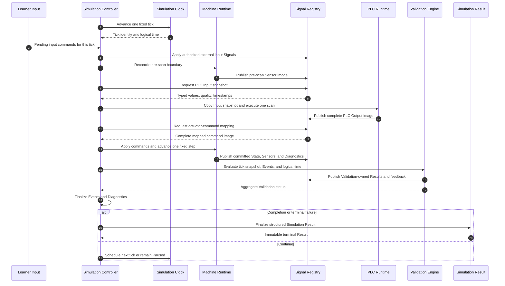
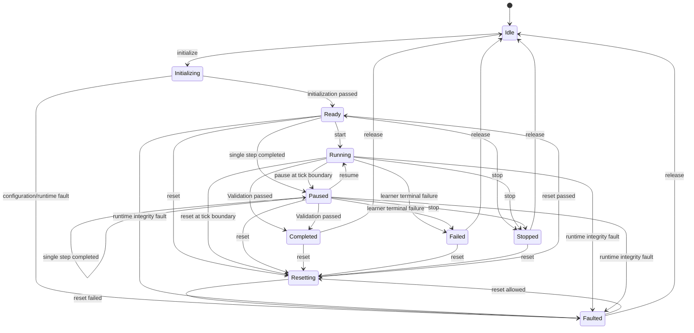
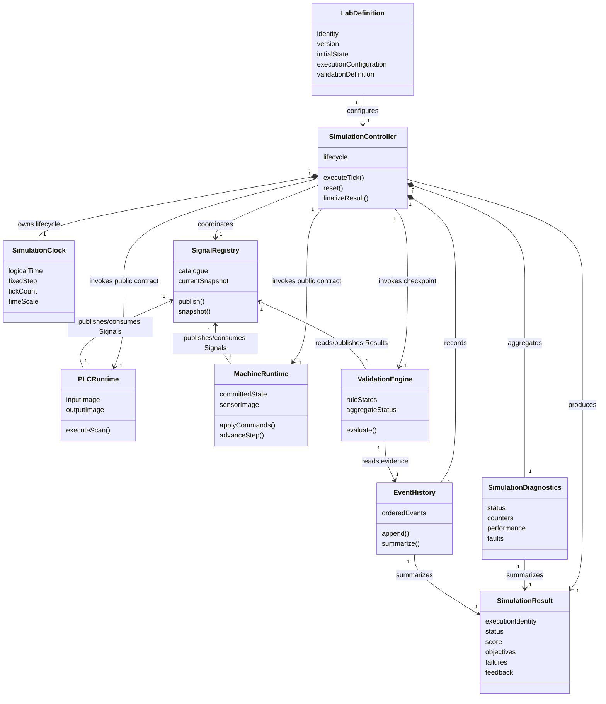

# SPEC-005 — Digital2Real Simulation & Validation Model

**Status:** Draft functional specification
**Specification owner:** Digital2Real Academy
**Scope:** Minimum deterministic orchestration and automatic Validation model for the first Academy vertical slice
**First target:** Lab 001 — Start/Stop Conveyor
**Implementation status:** Not implemented

The key words **MUST**, **MUST NOT**, **SHOULD**, **SHOULD NOT**, and **MAY** express requirement strength within this specification.

---

# 1. Purpose

The Simulation and Validation Model defines the minimum behavior required to execute one Digital2Real Lab deterministically and determine whether a learner solution satisfies its objectives.

Simulation orchestration is required because the PLC Runtime, Machine Runtime, Signal Layer, external learner inputs, and Validation Engine have separate responsibilities and update boundaries. A coordinator must decide when each participant acts, which Signal snapshot it observes, when values become visible, and when execution stops.

Automatic Validation is required because a correct learner outcome must be decided from observable behavior rather than from source-code shape, UI actions, or vendor-specific instructions. The same solution behavior must receive the same result when execution inputs are identical.

## 1.1 Why orchestration and Validation share one MVP specification

For the first vertical slice, Validation depends directly on deterministic tick boundaries, ordered Signal observations, simulation time, Events, and terminal conditions. Specifying the scheduler without its Validation checkpoints would leave acceptance behavior ambiguous. Specifying Validation without the simulation loop would leave evidence timing ambiguous.

They therefore share this one MVP specification to establish one coherent execution contract.

## 1.2 Separate runtime responsibilities

Although documented together, the responsibilities remain separate:

- the **Simulation Controller** schedules and coordinates execution;
- the **Simulation Clock** owns deterministic virtual time;
- the **PLC Runtime** executes the learner Program;
- the **Machine Runtime** reacts physically to accepted commands;
- the **Signal Registry** exchanges governed information;
- the **Validation Engine** observes evidence and produces assessment Results;
- the **Event History** records lightweight execution evidence;
- **Diagnostics** reports runtime health and performance;
- the **Simulation Result** summarizes the completed attempt.

The Validation Engine MUST NOT schedule runtimes, mutate PLC or Machine state, or decide physical behavior. The Simulation Controller MUST NOT evaluate educational correctness except by asking the Validation Engine for its current Result.

## 1.3 MVP intent

This specification is intentionally pragmatic. It defines only the architecture needed for a deterministic implementation of Lab 001 — Start/Stop Conveyor and a safe path to later extension.

It does not design an enterprise platform, distributed scheduler, complete industrial physics system, universal rule language, or final Academy interface.

---

# 2. Scope

## 2.1 Included

SPEC-005 includes:

- a deterministic fixed-step simulation loop;
- one Simulation Clock;
- canonical execution order;
- one PLC scan per simulation tick;
- one Machine update per simulation tick;
- Signal Registry synchronization;
- external learner-input application;
- initial-state publication;
- Validation checkpoints;
- objective, rule, failure, and completion evaluation;
- a simple normalized scoring model;
- lightweight Event History;
- Simulation Diagnostics;
- full Simulation Reset;
- pause, resume, stop, and manual single-step behavior;
- structured Simulation Result;
- Lab 001 conceptual Validation;
- minimum implementation acceptance criteria and readiness guidance.

## 2.2 Excluded

SPEC-005 does not include:

- UI rendering;
- a Ladder editor or complete control language;
- user authentication;
- persistent learner accounts;
- cloud execution;
- real PLC communication;
- OPC UA implementation;
- multiplayer;
- advanced Physics;
- distributed Simulation;
- multiple PLC tasks;
- interrupt execution;
- long-term analytics storage;
- AI-based Validation;
- final Academy interface design;
- backend architecture.

## 2.3 First implementation profile

The first implementation profile MUST support exactly one active Lab execution containing:

- one Lab Definition;
- one Simulation Controller;
- one fixed-step Simulation Clock;
- one Signal Registry;
- one PLC Runtime using the single-task cyclic model from SPEC-002;
- one Machine Runtime using the deterministic model from SPEC-003;
- one Validation Engine;
- one Event History;
- one Diagnostics collector;
- one Simulation Result.

The architecture may permit later extension, but the MVP MUST NOT introduce unused multi-runtime or distributed abstractions.

---

# 3. High-Level Architecture

```text
Lab Definition
      ↓
Simulation Controller
      ↓
Simulation Clock
      ↓
Machine Runtime
      ↓
Signal Layer
      ↓
PLC Runtime
      ↓
Signal Layer
      ↓
Machine Runtime
      ↓
Validation Engine
      ↓
Simulation Result
```

The diagram describes one coordinated execution path. It does not transfer ownership between blocks.

## 3.1 Lab Definition

The Lab Definition supplies the canonical Lab identity, version, Metadata, Objectives, Machine model, PLC model, Variables, Challenge, Validation rules, Resources, initial State, and execution configuration defined by SPEC-001.

It is immutable during one execution. Any material change creates a different execution input and therefore a different deterministic run identity.

## 3.2 Simulation Controller

The Simulation Controller coordinates one execution. It owns lifecycle, initialization order, tick scheduling, command acceptance boundaries, terminal decisions, and final Result assembly.

It does not own PLC Memory, Machine State, source Signals, or educational rule outcomes.

## 3.3 Simulation Clock

The Simulation Clock owns virtual Simulation time, fixed time step, tick count, time scale for host pacing, pause behavior, and maximum duration.

Logical time drives deterministic runtime behavior. Host elapsed time is diagnostic only.

## 3.4 Machine Runtime — pre-scan observation

At the start of a tick, the Machine Runtime exposes the committed Machine State produced by the preceding tick. It applies pending external Machine-domain inputs that are scheduled for this boundary and finalizes the pre-scan observation boundary without advancing the tick’s Physics twice.

The Machine then publishes Sensor Signals derived from this committed pre-scan State.

## 3.5 Signal Layer

The Signal Layer is represented in the MVP by one Signal Registry conforming to SPEC-004. It registers definitions, enforces ownership and Type, stores the current and previous accepted Signal states, preserves Timestamp and Quality, exposes snapshots, and emits Signal Events.

It does not allow direct references to runtime internals.

## 3.6 PLC Runtime

The PLC Runtime copies an approved Machine/User Signal snapshot into its Input Memory, executes exactly one canonical scan, and publishes its Output Signals.

The PLC cannot observe Machine changes caused by its newly published Outputs until the next tick’s PLC Input Update.

## 3.7 Machine Runtime — post-scan update

After PLC Output publication, the Machine Runtime consumes the mapped actuator-command Signal image, applies command precedence, advances Components and Physics exactly once for the tick duration, commits Machine State, and publishes updated Machine and Sensor Signals.

Those post-scan Sensor values are available in the Signal Registry immediately for Validation and visualization, but become PLC Input Memory only during the following tick.

## 3.8 Validation Engine

The Validation Engine observes approved Signal snapshots, Events, logical time, and its own Validation state. It evaluates rules at declared checkpoints and produces Validation-owned Signals, feedback, score, failures, and completion status.

It cannot write PLC, Machine, User, Simulation, or System-owned Signals.

## 3.9 Simulation Result

The Simulation Result is the immutable conceptual outcome of one execution. It contains identity, status, duration, score, objective and rule Results, failures, feedback, attempts, hint use, Event summary, Diagnostics, deterministic seed, and completion reason.

## 3.10 No direct runtime access

No runtime may access another runtime’s internal state.

All exchanged values MUST use SPEC-004 definitions, snapshots, mappings, and Events. Orchestration may invoke public lifecycle operations, but it MUST NOT read or write private runtime Memory or State.

---

# 4. Simulation Controller

The Simulation Controller is the coordinator for one Lab execution. It is not a PLC, Machine, Signal owner, Validation rule, or UI controller.

## 4.1 Responsibilities

The Simulation Controller MUST:

- load one immutable Lab Definition;
- validate required execution configuration;
- initialize runtimes in canonical order;
- initialize the Signal Registry and Signals;
- initialize Validation rules;
- start Simulation;
- pause Simulation;
- resume Simulation;
- stop Simulation;
- perform a full Simulation Reset;
- execute one or more deterministic simulation steps;
- accept external commands at declared boundaries;
- collect participant Diagnostics;
- expose Simulation status through Simulation-owned Signals;
- decide whether scheduling continues based on lifecycle and Validation Result;
- produce the final Simulation Result.

It MUST NOT:

- inspect learner Program internals to determine correctness;
- mutate PLC Memory directly;
- mutate Machine State directly;
- publish Machine or PLC-owned Signals;
- change Validation rule status directly;
- use rendering frames as ticks.

## 4.2 Controller states

The canonical states are:

| State | Meaning |
|---|---|
| Idle | No active initialized execution exists. |
| Initializing | Definition, Signals, runtimes, Clock, and Validation are being prepared. |
| Ready | Initialization passed; execution may Start or single-step. |
| Running | Automatic fixed-step scheduling is active. |
| Paused | Automatic scheduling is suspended; single-step is permitted. |
| Completed | Validation completion conditions passed. |
| Failed | A learner failure or terminal modeled Machine failure ended the attempt. |
| Stopped | Execution was intentionally stopped before completion or failure. |
| Faulted | Configuration or runtime integrity failure prevents trustworthy continuation. |
| Resetting | Full Simulation Reset is in progress. |

## 4.3 Valid transitions

```text
Idle ──initialize──> Initializing
Initializing ──success──> Ready
Initializing ──configuration/runtime failure──> Faulted
Ready ──start──> Running
Ready ──single step──> Paused
Ready ──stop──> Stopped
Running ──pause──> Paused
Paused ──resume──> Running
Paused ──single step──> Paused
Running or Paused ──completion──> Completed
Running or Paused ──learner terminal failure──> Failed
Running or Paused ──stop──> Stopped
Any active state ──runtime integrity failure──> Faulted
Ready, Running, Paused, Completed, Failed, Stopped, Faulted ──reset──> Resetting
Resetting ──success──> Ready
Resetting ──failure──> Faulted
Completed, Failed, Stopped, Faulted ──release──> Idle
```

An invalid requested transition MUST be rejected, recorded, and leave State unchanged. It becomes a runtime Fault only when the invalid transition indicates internal corruption rather than an ordinary rejected external command.

## 4.4 Start

Start is accepted only from Ready or as Resume from Paused. It begins host-paced automatic ticks without changing fixed logical step semantics.

## 4.5 Pause

Pause takes effect at the next complete tick boundary. A tick already in progress MUST complete atomically unless it faults.

Paused time does not advance Simulation logical time or tick count.

## 4.6 Resume

Resume changes Paused to Running at a boundary. The next tick uses the same fixed duration as any other tick.

## 4.7 Stop

Stop takes effect at a complete tick boundary, produces Stopped, finalizes a non-completed Simulation Result with completion reason `stopped`, and does not imply failure.

## 4.8 Single step

Single step executes exactly one complete canonical tick from Ready or Paused, then returns to Paused unless the tick completes, fails, or faults the execution.

## 4.9 Terminal decision authority

The Controller maps outcomes as follows:

- Validation Passed → Completed;
- terminal learner failure → Failed;
- unrecoverable modeled Machine Fault designated as learner/scenario failure → Failed;
- configuration or runtime integrity failure → Faulted;
- explicit Stop → Stopped;
- maximum duration or cycle limit → Failed when defined as learner timeout, otherwise Faulted when caused by scheduler corruption.

---

# 5. Simulation Clock

The Simulation Clock is a deterministic virtual clock. It MUST NOT depend directly on browser frame rate, animation frames, render completion, host CPU speed, or wall-clock drift.

## 5.1 Simulation time

Simulation time is the authoritative logical time for orchestration, Machine updates, Validation windows, Lab timeouts, and Signal timestamps that use the Simulation time domain.

It starts at zero after successful initialization and advances by exactly one fixed time step per executed tick.

## 5.2 Real elapsed time

Real elapsed time is host-observed duration between execution Start and terminal or current observation. It is Diagnostic and MAY vary between deterministic runs.

Real elapsed time MUST NOT affect PLC Results, Machine behavior, Validation, score based on Simulation time, or completion.

## 5.3 Fixed time step

The MVP uses one positive fixed time step for the complete execution. The Lab execution profile MUST declare it.

Recommended Lab 001 value:

```text
20 milliseconds per tick
```

The exact value is an execution input and part of the deterministic run identity.

## 5.4 Tick count

Tick count starts at zero. It increments once when a tick begins its canonical execution. Completed and failed attempted ticks SHOULD be distinguishable in Diagnostics.

Simulation time after a completed normal tick equals tick count multiplied by fixed time step under the MVP profile.

## 5.5 Time scale

Time scale controls only how quickly automatic ticks are paced relative to host time. Examples are paused, slower than real time, real-time-like, or accelerated.

Time scale MUST NOT alter fixed time step, tick order, or Results. If the host cannot maintain requested pacing, execution slows in real time rather than skipping logical ticks.

## 5.6 Paused time

While Paused:

- Simulation time does not advance;
- tick count does not advance;
- PLC scans do not execute automatically;
- Machine Physics does not advance;
- Validation time windows do not advance;
- real elapsed pause duration MAY be recorded diagnostically.

## 5.7 Maximum execution duration

Each Lab execution MUST declare a maximum Simulation duration or maximum tick count. Reaching the limit produces the configured timeout failure and a final Result.

Lab 001 SHOULD use a short limit sufficient for the required actions and stability window. The exact Product value remains an Open Question in Section 34.

## 5.8 Step-by-step execution

Manual single-step executes one complete tick with the same logical semantics as automatic Running mode. It MUST NOT expose partial phases as learner-controllable states in the MVP.

## 5.9 Why fixed-step is preferred

Fixed-step Simulation is preferred for the MVP because it:

- makes Timer, delay, sequence, and Validation behavior reproducible;
- makes replay a sequence of discrete ticks;
- avoids browser and host scheduling influence;
- simplifies PLC–Machine synchronization;
- makes unit and integration tests finite and predictable;
- is sufficient for Lab 001’s boolean control behavior;
- avoids premature numerical-solver design.

---

# 6. Execution Order

One complete Simulation tick MUST execute in this order:

1. Advance Simulation Clock.
2. Apply pending external inputs.
3. Update Machine pre-scan State.
4. Publish Machine Sensor Signals.
5. Copy Input Signals into PLC Input Memory.
6. Execute one PLC scan.
7. Publish PLC Output Signals.
8. Apply actuator commands to the Machine.
9. Update Machine Physics and internal State.
10. Publish updated Machine and Diagnostic Signals.
11. Execute Validation rules.
12. Record Events and Diagnostics.
13. Determine whether Simulation continues, completes, or fails.

## 6.1 Phase 1 — Advance Simulation Clock

The Clock increments tick count and advances Simulation logical time by the fixed step. The tick receives a stable identity and logical Timestamp.

For SPEC-002 Timer attribution, the PLC scan receives the logical interval since the preceding completed scan boundary. The first tick after initialization receives the declared initial interval; the MVP uses one fixed step.

## 6.2 Phase 2 — Apply pending external inputs

External learner actions, scenario controls, and approved fault inputs queued for this tick are applied in deterministic order to their Owner boundaries.

The order is:

1. lifecycle-critical Simulation commands already accepted for this boundary;
2. safety or scenario inputs;
3. learner command inputs;
4. instructor or test-harness inputs when authorized;
5. stable secondary order by input Identifier and submission sequence.

Direct UI mutation is prohibited. UI actions become User-owned Signals or approved commands before this phase.

## 6.3 Phase 3 — Update Machine pre-scan State

The Machine processes only pre-scan boundary effects such as accepted external physical inputs, Emergency State, Reset completion already scheduled for this boundary, and previously pending deterministic transitions.

This phase MUST NOT perform the tick’s main Physics integration. Its purpose is to expose one coherent committed State for Sensor sampling.

## 6.4 Phase 4 — Publish Machine Sensor Signals

The Machine derives and publishes a complete Sensor image from committed pre-scan Machine State. These Signals describe physical State before applying PLC Outputs from the current scan.

## 6.5 Phase 5 — Copy Inputs to PLC Input Memory

Mapped Machine Sensor Signals and User command Signals are copied into the PLC Input image according to SPEC-002 and SPEC-004.

Value, Quality, and source Timestamp MUST be preserved or explicitly mapped. The PLC Input image remains stable for the scan.

## 6.6 Phase 6 — Execute one PLC scan

The PLC executes exactly one Input-stable scan following SPEC-002. It evaluates the learner Program, Memory, Timers, Counters, and Diagnostics using the tick’s declared logical interval.

## 6.7 Phase 7 — Publish PLC Output Signals

The PLC publishes one complete Output Signal image. These Signals represent controller command intent, not physical feedback.

## 6.8 Phase 8 — Apply actuator commands

SPEC-004 Mapped relationships convert PLC Output Signals into the Machine actuator-command image. The Machine accepts, rejects, or constrains commands using lifecycle, Health, safety, fault, and physical rules.

## 6.9 Phase 9 — Update Machine Physics and internal State

The Machine advances exactly once by the fixed tick duration using accepted commands. It updates Components, objects, physical values, faults, and lifecycle according to SPEC-003, then atomically commits State.

## 6.10 Phase 10 — Publish updated Machine and Diagnostic Signals

The Machine publishes post-update physical feedback, Sensor observations, lifecycle, faults, and Diagnostics. PLC Runtime and Machine Runtime publish their own Diagnostics through owned Signals.

Post-update Sensor Signals are observable to Validation in the current tick but are not copied into PLC Input Memory until Phase 5 of the next tick.

## 6.11 Phase 11 — Execute Validation rules

Validation evaluates rules whose mode and trigger apply to this checkpoint. It observes the complete post-update Signal snapshot, ordered Events available for the tick, and Simulation logical time.

## 6.12 Phase 12 — Record Events and Diagnostics

The Controller finalizes the tick Event order and Diagnostics. Participant Events retain their Owners and source sequences. The Controller adds one orchestration phase order for deterministic cross-owner replay.

## 6.13 Phase 13 — Determine continuation

The Controller asks Validation for aggregate State, inspects runtime integrity and lifecycle commands, and chooses one outcome:

- schedule next tick;
- remain Paused after single step;
- Completed;
- Failed;
- Stopped;
- Faulted.

## 6.14 Current-scan versus next-scan visibility

| Value | Visible in current tick | Visible to PLC in next tick |
|---|---:|---:|
| External inputs applied before PLC Input copy | Yes | Already consumed in current tick |
| Pre-scan Machine Sensors | Yes, copied to PLC | May change before next tick |
| PLC Outputs from current scan | Machine and Validation after publication | PLC may read its own Output image according to SPEC-002 |
| Machine State caused by current PLC Outputs | Validation and observers after Machine update | Yes, through next tick’s Sensor copy |
| Post-update Machine Sensors | Validation and observers | Yes |
| Validation Results | Controller and observers after evaluation | Only if explicitly mapped in a future Lab; not mapped for Lab 001 |

This one-tick observation delay is mandatory. It prevents the current PLC scan from observing physical consequences of Outputs it has not yet published.

## 6.15 Why the order is deterministic

The order is deterministic because:

- every tick uses one fixed logical interval;
- every phase has one total position;
- every external input has an assigned tick and sequence;
- Signal ownership and update order are explicit;
- PLC and Machine each execute exactly once per tick;
- no phase races another asynchronously;
- Validation observes one committed checkpoint;
- terminal decisions occur only after the full tick.

---

# 7. Initialization

Initialization MUST follow this order:

1. Validate Lab Definition.
2. Create Signal Registry.
3. Register all Lab Signals.
4. Create Machine Runtime.
5. Create PLC Runtime.
6. Create Validation Engine.
7. Apply initial Machine State.
8. Apply initial PLC Memory State.
9. Initialize Simulation Clock.
10. Publish initial Signals.
11. Evaluate preconditions.
12. Set Simulation Controller to Ready.

## 7.1 Validate Lab Definition

Validation checks the minimum SPEC-001 conformance needed by the MVP:

- stable Lab identity and version;
- one Machine model;
- one PLC model and learner Program reference;
- complete initial State;
- required Signals and mappings;
- Validation Objectives and rules;
- fixed time step and limits;
- no duplicate identifiers;
- all references resolvable.

## 7.2 Create Signal Registry

The Registry begins empty with one catalogue and execution context. No runtime may publish before registration completes.

## 7.3 Register Signals

All definitions are registered and validated for Identifier, Namespace, Type, Owner, Source, Access, Scope, Persistence, Default Value, Units, Quality policy, and relationships.

## 7.4 Create runtimes

Machine, PLC, and Validation runtimes are created against public contracts only. Creation MUST NOT begin execution.

## 7.5 Apply initial State

Machine State, objects, lifecycle, faults, PLC Memory, Timer state, Counter state, and learner Program state are initialized from immutable execution inputs.

No retained State from another attempt is used in the MVP.

## 7.6 Initialize Clock

Simulation time and tick count are set to zero. Time scale and host pacing are configured but do not advance logical time.

## 7.7 Publish initial Signals

Owners publish initial values with Timestamp zero and declared Quality. Machine Sensor values derive from initial committed Machine State. PLC Outputs use defined initial/safe values.

## 7.8 Evaluate preconditions

Validation checks configuration-level and initial-state preconditions. Preconditions MUST NOT award completion before the learner has had the required observation period.

## 7.9 Initialization failure

Any invalid required definition, duplicate Signal, missing reference, incompatible Type, corrupt initial State, unsupported Program element, or rule configuration failure causes:

- initialization to stop;
- Controller State to become Faulted;
- no normal tick to execute;
- initial safe Outputs to remain effective;
- a configuration or runtime Diagnostic to be recorded;
- a Simulation Result with status Faulted when an execution identity was created.

Initialization failure is not a learner failure and MUST NOT reduce score or consume an attempt unless Product policy explicitly counts invalid learner Programs separately.

---

# 8. Reset Behaviour

The MVP supports one full Simulation Reset that restores the exact declared initial execution State without rebuilding unchanging definitions unnecessarily.

## 8.1 Full Simulation Reset restores

- Simulation time to zero;
- tick count to zero;
- Machine lifecycle and State;
- every Component’s Current and Previous State;
- object positions, ownership, properties, and lifecycle;
- PLC Memory;
- PLC Input and Output images;
- Timer State;
- Counter State;
- Temporary and Retentive Variables to Lab initial values;
- Signal Current and Previous Values;
- Signal Quality and Timestamp;
- Validation progress and rule States;
- eligible modeled faults to initial fault State;
- Event History to a new attempt segment or empty active history;
- score;
- completion and failure State;
- feedback;
- Diagnostics counters for the new execution attempt, while optional session-level reset count may remain;
- deterministic random generator to the configured seed when used.

## 8.2 Full Reset sequence

1. Controller enters Resetting at a complete tick boundary.
2. Automatic ticks stop.
3. Current attempt Result is finalized as Aborted when it had started.
4. Runtimes acknowledge reset readiness.
5. Machine, PLC, Signals, Validation, Clock, Events, and Diagnostics restore in canonical initialization order.
6. Initial Signals are republished.
7. Preconditions are evaluated.
8. Controller becomes Ready or Faulted.

## 8.3 Simulation Reset

Simulation Reset is the complete cross-subsystem reset defined above. It is the reset used to retry Lab 001 from a known initial State.

## 8.4 PLC Reset

PLC Reset affects only PLC-owned execution State according to SPEC-002. It does not move Machine objects, clear Machine faults, reset Simulation time, or clear Validation history unless an explicit Lab rule observes the reset.

For Lab 001, PLC Reset MUST set command Outputs to safe defaults and MUST NOT cause automatic restart.

## 8.5 Machine Reset

Machine Reset affects Machine lifecycle, Components, eligible faults, and physical State according to SPEC-003. It does not clear PLC Memory, learner Program State, Simulation time, or Validation State.

## 8.6 Fault acknowledgement

Fault acknowledgement records awareness of a fault. It does not necessarily clear the fault, repair the cause, reset a runtime, restore State, or resume operation.

## 8.7 Reset consistency

After full Simulation Reset, the initial Signal snapshot and runtime States MUST be identical to a fresh initialization with the same execution inputs and seed, apart from new execution/attempt identity and explicitly retained administrative reset count.

---

# 9. Validation Engine

The Validation Engine is a deterministic observer of Simulation behavior.

## 9.1 Permitted operations

Validation may only:

- read approved Signal definitions and snapshots;
- read approved Simulation and Signal Events;
- read Simulation logical time and tick identity;
- maintain private Validation State;
- produce Validation-owned rule, objective, score, completion, failure, and feedback Results;
- request terminal assessment from the Simulation Controller through its public Result contract.

## 9.2 Prohibited operations

Validation MUST NOT:

- write PLC Inputs, Outputs, Memory, Timers, Counters, or Programs;
- write Machine Commands, Components, State, Physics, Sensors, objects, or faults;
- advance or pause Simulation time;
- reorder Events;
- publish User-owned commands;
- read runtime internals not exposed through SPEC-004;
- inspect a learner Program to infer correctness unless a future separate static-analysis rule is approved.

## 9.3 Responsibilities

The Validation Engine MUST:

- initialize all rule States;
- evaluate mandatory, optional, bonus, and hidden safety Objectives;
- evaluate constraints;
- detect learner, Machine, runtime, and configuration failure classifications;
- track rule and objective progress;
- calculate deterministic score;
- generate structured feedback;
- determine aggregate Validation status;
- indicate when completion or terminal failure criteria are satisfied;
- preserve evidence references for Results.

## 9.4 Observation checkpoint

The canonical MVP checkpoint is Phase 11 after post-scan Machine State and Signal publication. Rules may also evaluate initialization, Signal-change, Event, or Simulation-end triggers, but evaluation is executed synchronously at the next canonical Validation checkpoint.

## 9.5 Private Validation State

Validation may privately store:

- rule State;
- trigger State;
- first and latest qualifying time;
- duration accumulation;
- sequence position;
- attempt count;
- observed evidence references;
- score contributions;
- emitted feedback identities.

This private State cannot be used as control input unless separately published as an approved Validation Signal and explicitly mapped by a future Lab. Lab 001 has no such mapping.

---

# 10. Validation Rule Model

Every Validation rule MUST define:

| Field | Required | Meaning |
|---|---:|---|
| `id` | Yes | Stable rule identity within the Lab version. |
| `description` | Yes | Observable behavior being assessed. |
| `type` | Yes | One MVP rule Type below. |
| `severity` | Yes | Informative, warning, error, safety, or blocking. |
| `objective reference` | Yes | One or more SPEC-001 Objective identifiers. |
| `observed signals` | Yes | Explicit approved Signal identifiers. |
| `expected condition` | Yes | Implementation-independent acceptance statement. |
| `evaluation mode` | Yes | Mode from Section 11. |
| `start condition` | Yes | Trigger that activates evaluation; may be immediate. |
| `success condition` | Yes | Evidence required to pass. |
| `failure condition` | No | Evidence that fails the rule before timeout. |
| `timeout` | No | Maximum Simulation duration after activation. |
| `tolerance` | No | Numeric or timing allowance with Units. |
| `required duration` | No | Duration for which success must remain stable. |
| `attempt limit` | No | Maximum qualifying tries within one Lab attempt. |
| `feedback` | Yes | Structured references for activation, pass, fail, and expiry. |
| `score impact` | Yes | Base, penalty, bonus, or none. |
| `status` | Runtime | Pending, Active, Passed, Failed, Skipped, or Expired. |

Rules MUST use Signals and Events, not direct runtime state.

## 10.1 State Rule

Evaluates whether one committed snapshot satisfies a state predicate.

Use for final states, command/feedback combinations, mode, fault state, and boolean or numeric conditions.

## 10.2 Transition Rule

Evaluates an allowed or required change from Previous to Current Signal State.

Use for rising/falling actions, starts, stops, fault onset, and recovery.

## 10.3 Sequence Rule

Evaluates an ordered series of states, changes, or Events. It maintains private sequence position.

Use for Start before Running, Stop before Stopped, and Reset without restart.

## 10.4 Timing Rule

Evaluates the time between two declared boundaries.

Use for maximum response time. It MUST use Simulation logical time and explicit tolerance.

## 10.5 Duration Rule

Evaluates whether a condition remains continuously true or false for a required duration.

Use for stable completion, sustained safety, and debounce-like educational requirements.

## 10.6 Safety Rule

Evaluates a safety invariant. A Safety Rule may be hidden before execution when disclosure would reveal the test and when the underlying safety principle has already been taught.

A blocking Safety Rule failure may terminate the Lab immediately after the current tick finalizes.

## 10.7 Constraint Rule

Evaluates a non-negotiable solution constraint such as prohibited output combination, range, attempt behavior, or unauthorized state.

## 10.8 Completion Rule

Combines mandatory rule Results, final State, and observation duration to decide completion readiness.

It does not replace individual Objective evidence.

## 10.9 Failure Rule

Detects a terminal learner or scenario failure such as timeout, blocked object, invalid controller State, or maximum cycle count.

Configuration and runtime integrity failures are reported through Error Handling and may produce Faulted rather than a learner rule failure.

## 10.10 Rule determinism

For the same ordered snapshots, Events, time, and initial Validation State, every rule MUST produce the same status, evidence, feedback, and score impact.

---

# 11. Evaluation Modes

## 11.1 Every Tick

Evaluates at every Phase 11 checkpoint while the rule is Active.

Appropriate for safety invariants, state constraints, and stable-duration tracking.

## 11.2 On Signal Change

Evaluates when any declared Signal value or relevant Quality changes during the tick.

Appropriate for edge, command, feedback, mode, and fault transitions. The engine consumes Signal Changed and Quality Changed Events rather than polling runtime internals.

## 11.3 On Event

Evaluates when a declared Simulation, Machine, PLC, or Signal Event occurs.

Appropriate for sequence steps, runtime faults, Reset, object boundaries, and lifecycle transitions.

## 11.4 At Simulation End

Evaluates once when the Controller proposes Completed, Failed, Stopped, Faulted, or maximum-duration termination.

Appropriate for summaries, attempt-wide constraints, and final-score adjustments. It MUST NOT retroactively hide earlier blocking failures.

## 11.5 During Time Window

Evaluates only within a declared logical interval relative to a trigger or absolute Simulation time.

Appropriate for response-time windows and observation periods.

## 11.6 Once After Trigger

Activates on a declared condition and evaluates one time at the next eligible checkpoint or after a declared delay.

Appropriate for checking post-Reset State, one response snapshot, or a single expected transition.

## 11.7 Trigger coalescing

If multiple triggers for one rule occur in one tick, the rule evaluates them in deterministic Event order. A rule definition MUST state whether it evaluates once using the final checkpoint snapshot or once per triggering Event. MVP rules SHOULD evaluate once per tick unless sequence evidence requires individual Events.

---

# 12. Validation States

## 12.1 Rule states

| State | Meaning |
|---|---|
| Pending | Rule is initialized but its start condition has not occurred. |
| Active | Rule is currently observing evidence. |
| Passed | Success condition has been satisfied, including duration requirements. |
| Failed | Failure condition occurred or a blocking acceptance condition was violated. |
| Skipped | Rule is not applicable under the execution profile or an approved prerequisite policy. |
| Expired | Rule did not pass before its timeout or evaluation window ended. |

Valid transitions:

```text
Pending → Active
Pending → Skipped
Active → Passed
Active → Failed
Active → Expired
Passed → Failed only for explicitly continuous safety/duration rules
```

Most Passed rules are terminal. Continuous Safety rules may remain monitoring after pass and transition to Failed if the invariant later breaks. This behavior MUST be declared.

Failed, Skipped, and Expired are terminal for one attempt unless a rule explicitly supports multiple sub-attempts under its attempt limit.

## 12.2 Complete Lab Validation states

| State | Meaning |
|---|---|
| Not Started | Validation is initialized but Simulation has not begun. |
| In Progress | At least one tick or learner action is under assessment. |
| Passed | Every mandatory Objective and completion condition passed with no blocking failure. |
| Failed | A terminal learner failure or blocking rule failure occurred. |
| Partially Passed | Execution ended without full completion but at least one Objective passed; not a successful Lab completion. |
| Aborted | Learner or system stopped/reset an otherwise trustworthy execution before terminal assessment. |
| Faulted | Validation cannot be trusted because configuration or runtime integrity failed. |

Valid transitions:

```text
Not Started → In Progress
Not Started → Faulted
In Progress → Passed
In Progress → Failed
In Progress → Partially Passed
In Progress → Aborted
In Progress → Faulted
```

Aggregate State does not return to In Progress within the same finalized attempt.

---

# 13. Objective Model

SPEC-005 uses the Objective categories established by SPEC-001 and adds hidden safety presentation policy.

## 13.1 Mandatory Objectives

Every mandatory Objective MUST pass for Lab completion. A failed or Expired mandatory Objective prevents Passed Validation.

## 13.2 Optional Objectives

Optional Objectives do not block completion. They may increase score or enrich feedback.

## 13.3 Bonus Objectives

Bonus Objectives reward optimized, robust, or advanced behavior. They may add score up to the score cap but cannot compensate for failed mandatory safety or correctness.

## 13.4 Hidden Safety Objectives

A hidden safety Objective is not disclosed as a precise pre-execution test but is still evaluated as a mandatory blocking invariant.

It is acceptable only when:

- the safety principle has already been taught or stated generally;
- revealing the exact test would expose the complete solution rather than support learning;
- the behavior represents a realistic invariant rather than a trick;
- failure feedback explains the violated principle after observation;
- the Objective does not depend on undisclosed arbitrary values;
- Product Owner and educational review approve the hidden status.

Hidden Objectives MUST NOT test undocumented interface behavior, vendor-specific knowledge, or surprising constraints.

## 13.5 Objective aggregation

An Objective passes when every required linked rule passes. It fails when a linked blocking rule fails or expires. Optional evidence may be reported separately.

---

# 14. Failure Conditions

The MVP supports at least:

- Emergency condition;
- unsafe Output combination;
- Motor Running while prohibited;
- required Sensor sequence violation;
- timeout exceeded;
- object blocked;
- Machine Fault;
- invalid PLC State;
- Simulation runtime Fault;
- maximum cycle count exceeded.

## 14.1 Learner failure

Learner failure is caused by observable learner-solution behavior violating a rule, constraint, safety invariant, sequence, timing requirement, or timeout.

It produces Validation Failed and Controller Failed when terminal.

## 14.2 Machine Fault

A Machine Fault is a modeled physical or Sensor fault from SPEC-003. Its effect depends on the Lab:

- expected diagnostic scenario: Simulation may continue;
- learner-caused or unhandled blocking condition: Validation may fail;
- scenario fault unrelated to learner correctness: Result records Machine Fault without unfair score penalty;
- Machine integrity failure outside the model: runtime Faulted.

## 14.3 Runtime Fault

Runtime Fault means PLC, Machine, Signal, Validation, Clock, or Controller integrity is no longer trustworthy. Examples include an exception, corrupt State, impossible internal transition, or deterministic contract violation.

It produces Controller Faulted and Validation Faulted. It is not a learner failure.

## 14.4 Configuration Fault

Configuration Fault is detected before or during initialization when definitions, references, Types, ownership, mappings, or initial State are invalid.

It prevents execution and produces Faulted.

## 14.5 Failure precedence

When multiple conditions occur in one tick, classification priority is:

1. configuration/runtime integrity Fault;
2. blocking safety learner failure;
3. other terminal learner failure;
4. modeled Machine Fault policy;
5. non-blocking warning.

All conditions remain recorded even when one determines terminal status.

---

# 15. Completion Conditions

A Lab may complete only when:

- every mandatory Objective passes;
- no blocking failure remains active;
- the required final Machine, PLC, and Signal State is reached;
- the minimum observation period has elapsed;
- the solution remains stable for the defined duration;
- no terminal runtime Fault exists.

## 15.1 Stable completion

Completion SHOULD NOT occur immediately after one correct Signal snapshot because transient or oscillating logic can momentarily appear correct.

A completion rule SHOULD require:

- the correct sequence of earlier behavior;
- a declared stable final State;
- continuous safety invariants;
- at least one full subsequent observation tick;
- a fixed logical stability duration appropriate to the Lab.

For Lab 001, completion requires successful Start latch, Stop response, Emergency inhibition, and post-Reset no-restart behavior, followed by a stable stopped State for a declared duration.

## 15.2 Terminal checkpoint

The Controller transitions to Completed only after the full tick finishes, Events and Diagnostics are recorded, and Validation reports Passed.

---

# 16. Scoring Model

The MVP uses a transparent score from 0 to 100. Correctness and safety take priority over speed.

## 16.1 Base score

Passing all mandatory correctness Objectives establishes a base score of 70.

Passing all mandatory safety Objectives is required to retain any passing score. A blocking safety failure caps the score below the minimum passing score even if other behavior is correct.

## 16.2 Score dimensions

| Dimension | MVP effect |
|---|---|
| Correctness | Required for the 70-point base score. |
| Safety | Required for passing; blocking failure applies passing cap. |
| Completion Time | Up to 10 bonus points for completing within a declared target; no penalty before maximum timeout. |
| Number of Attempts | Up to 10-point total penalty across repeated failed attempts, subject to Product policy. |
| Use of Hints | Declared penalty per scored hint, capped at 10 points. |
| Optional Objectives | Up to 10 bonus points. |
| Bonus Objectives | Included within the optional/bonus cap unless a Lab explicitly reallocates the same 100-point total. |

## 16.3 Simple calculation order

1. If mandatory correctness or safety does not pass, calculate diagnostic score but apply the passing cap.
2. If all mandatory Objectives pass, assign base score 70.
3. Add Completion Time bonus from 0 to 10.
4. Add Optional/Bonus Objective points from 0 to 10.
5. Subtract attempt penalties from 0 to 10.
6. Subtract hint penalties from 0 to 10.
7. Clamp final score to 0–100.

## 16.4 Minimum passing score

Recommended MVP minimum passing score is 70, with every mandatory correctness and safety Objective passed.

A score of 70 obtained without mandatory safety is prohibited.

## 16.5 Score caps

- blocking safety failure: maximum 49;
- uncompleted mandatory Objective: maximum 69;
- runtime/configuration Fault: no valid learner score; status Faulted;
- Aborted execution: provisional score may be shown but is not passing;
- total score: maximum 100 and minimum 0.

## 16.6 Non-scored Labs

A Lab may declare `scoring: disabled`. It still produces Objective, rule, failure, feedback, and completion Results. Passing remains based on mandatory conditions.

## 16.7 Time priority

Speed bonuses apply only after correctness and safety pass. A faster unsafe solution must never outscore a safe completed solution.

---

# 17. Feedback Model

Validation produces structured feedback based on observable evidence.

## 17.1 Feedback fields

Each item SHOULD define:

- feedback identity;
- rule id;
- severity;
- title;
- message;
- Simulation Timestamp;
- related Signal identifiers;
- related Objective;
- evidence references;
- hint eligibility;
- learner visibility;
- occurrence count or deduplication identity;
- terminal or non-terminal status.

## 17.2 Feedback Types

### Informative feedback

Explains progress, rule activation, or observed State without judging success or failure.

### Warning

Identifies risky, incomplete, or degraded behavior that does not yet fail the Lab.

### Error

Explains a failed correctness or constraint rule.

### Safety violation

Explains a violated safety invariant with clear priority and consequence. It may terminate the Lab.

### Success feedback

Confirms an Objective or rule passed and identifies the observed behavior.

### End-of-Lab summary

Summarizes completion, Objectives, failures, score, hints, and recommended review without exposing unrelated internal details.

## 17.3 Solution protection

Feedback MUST explain what was observed and why it did or did not satisfy the requirement. It SHOULD NOT reveal the complete control solution, exact Program structure, or every hidden test before the learner has reasoned about it.

Appropriate example:

> The Motor command became false when Start was released. The required behavior is to keep the conveyor running until Stop or Emergency is active.

Inappropriate example:

> Add a specific latch instruction in a named Network with these exact contacts.

## 17.4 Feedback determinism

Equivalent evidence MUST produce equivalent feedback identifiers, severity, message template, and ordering. Localization may change text but not meaning or Result.

---

# 18. Event History

The MVP Event History is an in-memory, bounded, ordered record for one execution. It supports Validation evidence, Diagnostics, Result summary, and tests. It is not long-term analytics persistence.

## 18.1 Recorded Event Types

- Simulation Started;
- Simulation Paused;
- Simulation Resumed;
- Simulation Reset;
- Input Changed;
- Output Changed;
- Machine State Changed;
- Validation Rule Activated;
- Validation Rule Passed;
- Validation Rule Failed;
- Lab Completed;
- Lab Failed;
- Runtime Fault.

The history MAY retain other SPEC-002, SPEC-003, and SPEC-004 Events needed by Lab rules.

## 18.2 Event fields

Every Event SHOULD include:

- id;
- Type;
- Simulation Timestamp;
- tick identity;
- orchestration phase;
- source Owner and source identity;
- source sequence when available;
- related Signal identifiers;
- related rule or Objective identifiers when applicable;
- correlation identity;
- Metadata.

## 18.3 Ordering

Events are ordered by:

1. tick identity;
2. canonical phase number;
3. source sequence;
4. stable Event identity as final tie-breaker.

This ordering does not replace the original source sequence.

## 18.4 Bounded history

The MVP MUST retain enough Events for the maximum configured execution. If a hard capacity exists, reaching it MUST cause a defined Fault or deterministic compaction that cannot remove Validation evidence.

Silent Event loss is prohibited.

## 18.5 Reset history

A full Reset finalizes the current attempt Event summary and begins a new active attempt history. Whether previous attempt summaries remain in the session Result is a Product policy; the MVP Result MUST at least preserve attempt count and terminal summaries.

---

# 19. Diagnostics

Simulation Diagnostics are read-only observations. They do not control deterministic behavior except where a declared execution limit is itself part of configuration.

## 19.1 Required Diagnostics

| Diagnostic | Meaning |
|---|---|
| Status | Current Simulation Controller State. |
| Simulation time | Current virtual logical time. |
| Real elapsed time | Host-observed duration excluding or separately reporting pause. |
| Tick count | Attempted/completed tick identity counts. |
| PLC scan count | Completed PLC scans. |
| Average scan duration | Host average PLC scan duration; performance only. |
| Maximum scan duration | Highest host PLC scan duration; performance only. |
| Active faults | Classified runtime, Machine, PLC, Signal, and configuration faults. |
| Active Validation rules | Rule identities currently Active. |
| Signal update count | Accepted Signal updates by Owner/category or total. |
| Last error | Latest runtime/configuration Error with source and classification. |
| Deterministic run identifier | Identity derived from or linked to canonical execution inputs. |

## 19.2 Learner-visible Diagnostics

Learners MAY see:

- Simulation status and logical time;
- current attempt and completion State;
- modeled Machine/PLC Diagnostics intended by the Lab;
- active Validation progress when not hidden;
- relevant fault classification;
- clear runtime-failure notice;
- score and feedback after applicable checkpoints.

## 19.3 Internal Diagnostics

Internal-only or advanced Diagnostics MAY include:

- host phase durations;
- stack or exception details;
- raw rule evaluation traces;
- hidden safety rule identity before disclosure;
- Signal Registry counters;
- deterministic hashes;
- configuration validation detail.

Internal Diagnostics MUST NOT leak complete solutions or sensitive platform detail to learners.

## 19.4 Diagnostic separation

Host performance variation MUST NOT alter Simulation Results. Average and maximum scan duration are recorded for implementation health, while PLC logical scan behavior uses fixed Simulation timing as configured.

---

# 20. Determinism

Given the same:

- Lab Definition and version;
- learner Program and version;
- initial Machine and PLC State;
- ordered external inputs and their assigned ticks;
- Simulation configuration;
- Signal catalogue and mappings;
- runtime semantic versions;
- deterministic seed when applicable;

the Simulation MUST produce the same:

- tick and phase sequence;
- Signal history;
- Machine behavior;
- PLC Results and Outputs;
- Event History;
- Validation rule and Objective Results;
- failure and completion classification;
- feedback identities and ordering;
- score;
- deterministic portions of the Simulation Result.

Real elapsed duration and host performance Diagnostics may differ and are excluded from deterministic equality.

## 20.1 Prohibited non-determinism

The MVP MUST avoid:

- browser frame rate as Simulation time;
- system clock drift as logical time;
- unordered Event or Signal execution;
- uncontrolled random values;
- asynchronous races between PLC, Machine, Signal, and Validation phases;
- direct UI mutation of runtime State;
- iteration order based on unordered collections;
- unrecorded external input timing;
- host-language numeric behavior not covered by the MVP value domain;
- background Validation that completes after the terminal decision.

## 20.2 Sequential MVP execution

The MVP SHOULD execute tick phases synchronously in one logical sequence. An implementation may use asynchronous host operations only outside the deterministic phase contract and must await them before crossing the relevant boundary.

## 20.3 Deterministic run identifier

The Result SHOULD contain an identifier or digest derived from canonical execution inputs. The exact digest algorithm is an implementation decision, but equivalent input sets must resolve to the same comparison identity under one versioned method.

---

# 21. Randomness

Randomness is optional for future Labs and is not required for Lab 001.

When used:

- it MUST come from a seeded deterministic generator;
- seed MUST be an execution input;
- generator algorithm/version MUST be identified;
- sampling order MUST be deterministic;
- every external random source is prohibited;
- seed MUST be stored in the Simulation Result;
- replay MUST recreate the same sampled sequence.

Lab 001 — Start/Stop Conveyor MUST use no random behavior.

---

# 22. Lab 001 Example

## 22.1 Lab identity

| Property | Conceptual value |
|---|---|
| Lab id | `D2R-LAB-001` |
| Title | Start/Stop Conveyor |
| Version | `1.0.0` |
| Fixed step | 20 ms |
| Randomness | Disabled |
| Machine | One Motor-driven Conveyor with Emergency State |
| PLC | One single-task cyclic controller |
| Validation | Automatic Signal/Event observation |

## 22.2 Scenario

- Start pushbutton requests conveyor start.
- Stop pushbutton requests conveyor stop.
- Emergency Stop prevents operation.
- Motor Output must remain active after Start is released.
- Stop has priority over Start.
- Emergency has priority over all normal commands.
- Reset clears eligible State but must not automatically restart the conveyor.

No complete Ladder or Program solution is specified.

## 22.3 Signals

| Identifier | Owner | Type | Initial value | Meaning |
|---|---|---|---|---|
| `sig.user.lab001.start_request` | User | Boolean | false | Momentary learner Start request. |
| `sig.user.lab001.stop_request` | User | Boolean | false | Momentary learner Stop request. |
| `sig.machine.lab001.emergency_active` | Machine | Boolean | false | Physical/simulated Emergency condition. |
| `sig.plc.lab001.motor_run_command` | PLC | Boolean | false | PLC command request for Motor run. |
| `sig.machine.lab001.motor_running` | Machine | Boolean | false | Physical Motor Running feedback. |
| `sig.machine.lab001.lifecycle` | Machine | Enum | `Stopped` | Committed Machine lifecycle. |
| `sig.simulation.lab001.logical_time` | Simulation | Timestamp | 0 ms | Simulation logical time. |
| `sig.validation.lab001.status` | Validation | Enum | `NotStarted` | Aggregate Validation State. |
| `sig.validation.lab001.score` | Validation | Float | 0 | Current normalized score. |
| `sig.system.lab001.runtime_status` | System | Enum | `Initializing` | Cross-runtime execution health. |

Mappings copy User requests into PLC Input Memory, PLC Motor command into the Machine actuator-command image, and Machine Emergency/feedback into PLC Input Memory only at the canonical next Input Update.

## 22.4 Initial State

- Controller State becomes Ready after initialization.
- Simulation time and tick count are zero.
- Start and Stop requests are false.
- Emergency is false.
- PLC Input image reflects false requests and Emergency false.
- PLC Motor Output is false.
- Machine Motor is stopped.
- Machine lifecycle is Stopped or Ready-equivalent as defined by the Lab Machine profile.
- PLC Internal Memory, Timers, and Counters use declared initial values.
- all Validation rules are Pending;
- score is zero;
- Event History contains initialization evidence only.

## 22.5 Learner actions

A complete successful conceptual attempt includes:

1. Start request becomes true for at least one tick.
2. PLC publishes Motor command true.
3. Machine applies the command and publishes Motor Running true.
4. Start request returns false.
5. Motor command remains true and Machine remains Running.
6. Stop request becomes true.
7. PLC publishes Motor command false with Stop priority.
8. Machine reaches Motor Running false.
9. Start and Stop are tested together; Motor command remains false.
10. Emergency becomes active; Motor command remains or becomes false and physical Motor stops.
11. Emergency clears and an authorized Reset occurs.
12. Motor command remains false until a new Start request.
13. final Stopped State remains stable for the required duration.

The test harness or learner flow may order the safety checks through declared scenario inputs. Inputs and assigned ticks are recorded.

## 22.6 Mandatory Objectives

### `OBJ-L001-START`

Start causes the conveyor to run when Stop and Emergency are inactive.

### `OBJ-L001-HOLD`

The run command remains active after Start is released.

### `OBJ-L001-STOP`

Stop causes the run command and physical Motor State to stop.

### `OBJ-L001-PRIORITY`

Stop has priority when Start and Stop are active together.

### `OBJ-L001-RESET`

Reset leaves the Motor command off and does not restart without a new Start request.

## 22.7 Hidden safety Objective

### `OBJ-L001-EMERGENCY`

Emergency prevents and removes Motor operation regardless of Start or retained run State.

The general safety principle MUST be disclosed before execution. The exact injection tick may remain hidden so the learner cannot hardcode one sequence position.

## 22.8 Validation rules

### `RULE-L001-START-RUN`

- Type: Sequence Rule
- Severity: blocking correctness
- Objective: `OBJ-L001-START`
- Observes: Start, Stop, Emergency, Motor command, Motor Running
- Starts: valid Start rising Event while Stop and Emergency are false
- Passes: Motor command becomes true, then Motor Running becomes true within configured response time
- Fails: timeout or prohibited State
- Mode: On Signal Change and During Time Window

### `RULE-L001-HOLD-AFTER-RELEASE`

- Type: Duration Rule
- Severity: blocking correctness
- Objective: `OBJ-L001-HOLD`
- Starts: Start falls after successful run
- Passes: Motor command and Running feedback remain true for the defined observation duration while Stop and Emergency remain false
- Fails: Motor command or Running becomes false without Stop, Emergency, or fault
- Mode: Every Tick

### `RULE-L001-STOP`

- Type: Timing Rule
- Severity: blocking correctness
- Objective: `OBJ-L001-STOP`
- Starts: Stop becomes true while running
- Passes: Motor command becomes false on the next eligible PLC Output publication and physical feedback becomes false within Machine response tolerance
- Fails: timeout
- Mode: On Signal Change and During Time Window

### `RULE-L001-STOP-PRIORITY`

- Type: Safety/Constraint Rule
- Severity: blocking
- Objective: `OBJ-L001-PRIORITY`
- Starts: Start and Stop are simultaneously true
- Passes: Motor command is false
- Fails: Motor command is true during the observed condition
- Mode: Every Tick

### `RULE-L001-EMERGENCY-INHIBIT`

- Type: Safety Rule
- Severity: safety blocking
- Objective: `OBJ-L001-EMERGENCY`
- Starts: Emergency becomes true or Start is requested while Emergency is already true
- Passes: Motor command is false and physical Motor reaches stopped State within tolerance
- Fails: Motor command remains true after the eligible PLC scan, or Motor operation starts while Emergency is active
- Mode: Every Tick and On Signal Change
- Learner visibility: Objective principle visible; exact trigger schedule hidden

### `RULE-L001-RESET-NO-RESTART`

- Type: Sequence/Duration Rule
- Severity: blocking correctness
- Objective: `OBJ-L001-RESET`
- Starts: Reset completes after Emergency test
- Passes: Motor command and Running feedback remain false for the stability duration without a new Start rising Event
- Fails: automatic restart
- Mode: Once After Trigger followed by Every Tick duration

### `RULE-L001-COMPLETION`

- Type: Completion Rule
- Severity: blocking
- Observes: all mandatory rule Results, faults, final State, logical time
- Passes: all mandatory and safety rules pass, no blocking failure is active, and final stopped State remains stable
- Mode: Every Tick after prerequisite rules pass

## 22.9 Completion conditions

- all six mandatory/safety Objectives pass;
- no blocking failure remains active;
- Motor command is false;
- Motor Running feedback is false;
- Emergency is cleared;
- no new Start request has occurred after Reset;
- stable stopped State persists for the configured observation duration;
- maximum execution duration is not exceeded.

## 22.10 Failure conditions

- Motor command true while Emergency is active after the eligible scan boundary;
- Motor physically Running beyond Emergency stop tolerance;
- Motor command true when Start and Stop are simultaneously active;
- Motor command falls solely because Start is released during the hold test;
- Stop response timeout;
- automatic restart after Reset;
- invalid PLC State or unsupported Program behavior;
- modeled blocking Motor Fault under the Lab policy;
- runtime/configuration Fault;
- maximum duration or cycle count exceeded.

## 22.11 Expected feedback

Examples:

- Success: “The conveyor started after a valid Start request.”
- Error: “The run command was lost when Start was released.”
- Success: “Stop removed the Motor command with the required priority.”
- Safety violation: “The Motor command was active while Emergency was asserted.”
- Error: “Reset caused the conveyor to restart without a new Start request.”
- Completion: “Start, hold, Stop, priority, Emergency, and Reset behavior remained correct and stable.”

Feedback references observed Signals and timestamps without prescribing a Program instruction or complete solution.

## 22.12 Scoring approach

- base 70 after all mandatory correctness and safety rules pass;
- up to 10 time bonus for completion within target Simulation time;
- up to 10 optional/bonus points if Lab 001 defines an optional diagnostic Objective;
- attempt and hint penalties up to 10 each;
- Emergency violation caps score at 49;
- incomplete mandatory behavior caps score at 69;
- runtime/configuration Fault produces no valid learner score.

---

# 23. Sequence Diagram



The diagram shows one complete tick. Messages are public contract interactions, not direct internal-state access.

---

# 24. State Diagram



Invalid transitions are rejected and recorded without changing State unless they reveal internal corruption.

---

# 25. Component Relationships



The relationships express coordination and public contracts, not shared internal State.

---

# 26. Simulation Result

The Simulation Result is a conceptual immutable record finalized when an execution reaches Completed, Failed, Stopped, Aborted through Reset, or Faulted.

## 26.1 Required fields

| Field | Meaning |
|---|---|
| Lab id | Stable SPEC-001 Lab identity. |
| Lab version | Exact executed Lab version. |
| Execution id | Unique execution identity. |
| Deterministic run id | Comparison identity for canonical execution inputs. |
| Status | Passed, Failed, Partially Passed, Aborted, Stopped, or Faulted as mapped from Controller/Validation. |
| Start time | Simulation start identity and optional host Timestamp. |
| Simulation duration | Final logical Simulation time. |
| Real duration | Host-observed Diagnostic duration. |
| Score | Normalized 0–100, disabled, provisional, or invalid for runtime Fault. |
| Objectives | Mandatory, optional, bonus, and hidden-safety outcomes with evidence. |
| Validation rules | Rule definitions/version references, final States, timestamps, and evidence. |
| Failures | Classified learner, Machine, runtime, and configuration failures. |
| Feedback | Ordered structured feedback items. |
| Attempts | Attempt count and terminal summary per attempt retained by policy. |
| Hints used | Hint identities, use time, and score effect. |
| Event summary | Counts and key Event references, not necessarily every raw Event. |
| Diagnostics | Final deterministic Diagnostics and selected host performance summary. |
| Deterministic seed | Seed and generator version when used; null for Lab 001. |
| Completion reason | Stable reason code and human-readable summary. |

## 26.2 Result consistency

- Result references exact SPEC-001 through SPEC-005 semantic versions used.
- Deterministic fields MUST compare equal for equivalent executions.
- Real duration and host performance are explicitly non-deterministic Diagnostics.
- Faulted Results MUST not present a valid learner score.
- Hidden safety rules become visible according to feedback policy after evaluation.
- Result MUST distinguish Stop, Reset/Abort, learner Failure, and runtime Fault.

## 26.3 Result ownership

The Controller assembles the Result from source-owned records. Validation owns score and educational outcomes; runtimes own their Diagnostics; Event History owns recorded Event sequence. Assembly does not transfer source ownership.

---

# 27. Error Handling

## 27.1 Invalid Lab configuration

Detected before normal execution. Controller becomes Faulted. No learner failure or valid score is produced.

## 27.2 Missing Signal

If a required definition or current sample is missing during initialization, initialization Faults. If a required Signal becomes unavailable during execution, apply its Quality/mapping policy; when trustworthy evaluation cannot continue, runtime becomes Faulted.

## 27.3 Duplicate Signal

Duplicate Identifier or conflicting active Namespace path invalidates the catalogue. Initialization Faults.

## 27.4 Invalid data Type

An incompatible update is rejected by the Signal Registry and recorded. If it is required for the tick, the execution becomes Faulted. A learner-originated invalid command may instead be classified as learner input rejection when the runtime remains trustworthy.

## 27.5 Runtime exception

An unhandled exception in Controller, Clock, Signal, PLC, Machine, Event, Diagnostics, or Result assembly stops the tick, applies safe Output policy, and produces Faulted.

## 27.6 Validation rule exception

If one rule cannot evaluate due to an implementation exception or invalid rule definition, Validation becomes Faulted and the Controller becomes Faulted. It MUST NOT mark the learner Failed.

## 27.7 Simulation timeout

When declared maximum logical duration or tick count is reached normally, timeout is a learner Failure if the Lab defines completion within that limit. If timeout results from scheduler inability or stalled runtime integrity, it is a runtime Fault.

## 27.8 Impossible State transition

An ordinary invalid external command is rejected and recorded. An internally requested transition that violates the Controller transition model indicates corruption and produces Faulted.

## 27.9 Corrupted initial State

Initialization stops before Ready. Controller becomes Faulted. No attempt execution begins.

## 27.10 Tick atomicity on error

The MVP MUST define a safe rollback or failure boundary. The minimum acceptable policy is:

- never begin the next tick;
- do not publish partial Signal snapshots as completed phase Results;
- apply configured safe PLC Outputs when possible;
- retain diagnostic evidence of the failed phase;
- classify the execution Faulted.

Full transactional rollback of Machine and PLC State is not required for the MVP because the execution terminates and Reset restores canonical initial State.

## 27.11 Lab Failed versus Faulted

| Condition | Controller | Validation | Learner score |
|---|---|---|---|
| Observable learner rule violation | Failed | Failed | Valid diagnostic score with caps |
| Expected modeled Machine fault handled by Lab | Running or Failed per rule | In Progress or Failed | Per Lab rule |
| Configuration error | Faulted | Faulted/Not Started | Invalid |
| Runtime implementation failure | Faulted | Faulted | Invalid |
| Explicit learner Stop | Stopped | Aborted or Partially Passed | Provisional/non-passing |
| Full Reset during attempt | Resetting → Ready | Prior attempt Aborted | Prior provisional summary |

---

# 28. MVP Boundaries

## 28.1 Required in first implementation

- fixed-step Simulation Clock;
- Simulation Controller lifecycle;
- Signal Registry integration conforming to the required subset of SPEC-004;
- one PLC scan per tick;
- one Machine Runtime update per tick;
- automatic deterministic Validation;
- lightweight Event History;
- Simulation Diagnostics;
- full Reset;
- Pause and Resume;
- manual single-step execution;
- deterministic Simulation Result;
- Lab 001 support;
- safe runtime Fault handling;
- no direct cross-runtime State access.

## 28.2 Deferred

- multiple PLC tasks;
- interrupt execution;
- distributed Simulation;
- 3D Physics;
- real-time OPC UA;
- persistence backend;
- multiplayer;
- AI Validation;
- advanced scoring;
- adaptive hints;
- replay visualization;
- variable-step Physics;
- multiple Machines or PLCs in one execution;
- long-term Event analytics;
- physical equipment control.

## 28.3 Deliberate simplicity

Deferred capabilities MUST NOT create placeholder services, empty folders, unused abstractions, or speculative interfaces in the MVP. Extension should occur only when a concrete approved Lab requires it.

---

# 29. Acceptance Criteria

The first implementation is acceptable only when all criteria pass:

1. Repeating the same canonical execution inputs produces the same deterministic Signal history, Machine behavior, Validation Result, score, and deterministic Result fields.
2. Simulation can Start, Pause, Resume, single-step, Stop, and full Reset through valid Controller transitions.
3. PLC and Machine Runtimes communicate only through SPEC-004 Signal snapshots and mappings.
4. Validation never mutates PLC, Machine, Signal-owner, User, or Simulation State outside Validation-owned Results.
5. Lab 001 detects correct Start, retained run after Start release, Stop response, and Stop-over-Start priority.
6. Lab 001 detects Emergency inhibition and Motor operation violations.
7. Full Reset returns every runtime, Signal, Clock, Event, Diagnostic, Validation, score, and completion State to the declared initial execution State.
8. Every terminal execution produces a structured Simulation Result.
9. Runtime/configuration Faults are distinguishable from learner Failures and do not produce a valid learner score.
10. Rendering speed and browser frame rate do not affect deterministic Results.
11. Machine Sensor changes caused by current PLC Outputs are sampled by the PLC no earlier than the next tick.
12. One PLC scan and one Machine Physics update occur per completed normal tick.
13. Event ordering is stable and sufficient to reproduce Lab 001 rule evaluation.
14. Stop, Emergency, and Reset tests do not reveal or require a particular Program instruction or vendor syntax.
15. Maximum logical duration terminates a non-completing Lab deterministically.

---

# 30. Implementation Readiness Checklist

## 30.1 Required modules

The first implementation requires these logical modules; names and file layout are not specified:

- Signal Registry;
- Simulation Clock;
- Simulation Controller;
- minimal Machine Runtime;
- minimal PLC Runtime;
- Validation Engine;
- Event History;
- Simulation Diagnostics;
- Simulation Result assembler;
- Lab 001 Definition and test fixture.

## 30.2 Required public contracts

- Lab Definition loading and validation;
- Signal definition registration, owned publication, snapshot, mapping, and Event subscription;
- Clock initialize, advance, pause, resume, and reset;
- PLC initialize, load Program, copy Inputs, execute one scan, publish Outputs, reset, and Diagnostics;
- Machine initialize, reconcile pre-scan boundary, publish Sensors, apply commands, advance one step, reset, and Diagnostics;
- Validation initialize, evaluate checkpoint, reset, and return aggregate Result;
- Event append, ordered query, summary, and reset;
- Controller lifecycle commands and status;
- Result finalization.

Contracts MUST expose values through SPEC-004 and lifecycle results, not internal State references.

## 30.3 Dependencies on SPEC-001 to SPEC-004

- SPEC-001: Lab, Objective, Challenge, initial State, Validation definition, Progress linkage.
- SPEC-002: single-task PLC scan, Memory, Output publication, logical timing, Reset, Diagnostics.
- SPEC-003: Component/Physics State, actuator commands, Sensor publication, faults, Reset.
- SPEC-004: Signal identity, ownership, Type, Quality, Events, Namespace, mappings, snapshots.

## 30.4 Minimum unit tests

At minimum:

- Clock advances fixed time and ignores host pacing;
- pause does not advance time;
- single-step executes one tick;
- Controller valid and invalid transitions;
- Signal duplicate, Type, Owner, Current/Previous, Timestamp, and Quality rules;
- tick phase order;
- PLC executes once per tick;
- Machine updates once per tick;
- post-update Sensors reach PLC only next tick;
- each MVP Validation rule Type and evaluation mode;
- rule State transitions;
- score base, penalties, bonuses, caps, and non-scored mode;
- Event ordering;
- full Reset equality with fresh initialization;
- Fault versus learner Failure classification;
- deterministic Result equality excluding host Diagnostics.

## 30.5 Minimum integration tests

- correct Lab 001 solution completes;
- Start release without latch fails hold rule;
- Stop stops Motor;
- simultaneous Start/Stop gives Stop priority;
- Emergency blocks Start;
- Emergency stops active Motor within tolerance;
- Reset does not restart;
- timeout fails incomplete solution;
- pause/resume does not change Result;
- accelerated host pacing does not change Result;
- single-step and automatic execution produce equal Results for equal input ticks;
- missing or duplicate Signal Faults initialization;
- Validation exception Faults runtime without learner penalty;
- full Reset followed by replay produces initial-equivalent behavior.

## 30.6 Unresolved decisions

Only the blocking Product decisions in Section 34 remain. Technical details may use this specification’s recommended defaults for an initial prototype after explicit acceptance.

## 30.7 Implementation risks

- phase ordering may leak through direct references;
- Reset may omit hidden State;
- host asynchronous behavior may reorder updates;
- Validation may become Lab-specific code rather than data-driven rules;
- learner Program representation is not yet formally specified;
- numeric semantics beyond Lab 001 booleans remain incomplete.

## 30.8 Recommended implementation order

1. Signal Registry
2. Simulation Clock
3. Simulation Controller
4. Minimal Machine Runtime
5. Minimal PLC Runtime
6. Validation Engine
7. Event History
8. Diagnostics
9. Simulation Result
10. Lab 001 integration

Each step SHOULD add tests before the next dependency is introduced. Lab 001 integration must not begin until Signal ownership and one-tick visibility tests pass.

## 30.9 Readiness gate

MVP implementation may begin after:

- SPEC-005 approval;
- Product Owner answers or accepts recommendations for Section 34 blockers;
- a minimal learner Program representation is approved for Lab 001;
- exact implementation package scope is approved under the repository workflow;
- the existing repository migration state is reconciled with the implementation branch.

---

# 31. Architectural Decisions

## AD-001 — Fixed-step Simulation

**Decision:** The MVP uses one fixed logical duration per tick.

**Rationale:** It provides reproducible timing, simple replay, predictable tests, and sufficient fidelity for Lab 001 without a speculative solver.

## AD-002 — Deterministic execution

**Decision:** Every phase, Signal update, Event, rule, and terminal decision has total ordering.

**Rationale:** Equivalent learner behavior must produce equivalent assessment.

## AD-003 — Validation is an observer

**Decision:** Validation reads approved Signals, Events, and time and writes only Validation-owned Results.

**Rationale:** Assessment cannot be trustworthy if it changes the behavior being assessed.

## AD-004 — Signal-only communication

**Decision:** PLC, Machine, Validation, Simulation, and future consumers exchange values only through SPEC-004.

**Rationale:** Direct state access would violate approved runtime separation and prevent replacement or replay.

## AD-005 — One coordinated Simulation tick

**Decision:** One tick contains exactly one PLC scan and one Machine Physics update in canonical order.

**Rationale:** This is the smallest complete causal loop and prevents asynchronous races.

## AD-006 — Machine consequences reach PLC next tick

**Decision:** Post-Output Machine changes are published in the current tick but sampled by PLC Input Memory only in the next tick.

**Rationale:** A PLC cannot observe physical consequences before it publishes the causing command.

## AD-007 — Pre-scan Machine update does not duplicate Physics

**Decision:** Pre-scan reconciliation applies scheduled boundary inputs and exposes committed prior State; the main Physics update occurs only after PLC Outputs.

**Rationale:** The required sequence names Machine twice, but the MVP contract permits exactly one Physics advancement per tick.

## AD-008 — Structured Simulation Result

**Decision:** Every terminal execution produces one versioned Result with source-owned evidence.

**Rationale:** Completion, failure, replay, testing, and future Progress need one durable conceptual outcome.

## AD-009 — Minimal Event History

**Decision:** The MVP stores a bounded ordered history for one execution without a persistence backend.

**Rationale:** Validation and Diagnostics require evidence, but long-term analytics architecture is not required for the first Lab.

## AD-010 — Scheduler and Validation share one MVP specification

**Decision:** Orchestration and Validation timing are documented together while remaining separate modules.

**Rationale:** Rule meaning depends on checkpoint timing; separate initial specifications would risk contradictory boundaries.

## AD-011 — Terminal decisions occur after a complete tick

**Decision:** Completion and learner Failure finalize only after post-update Signals, Validation, Events, and Diagnostics.

**Rationale:** Partial ticks would create incomplete evidence and inconsistent Reset/replay behavior.

## AD-012 — Runtime Fault is not learner Failure

**Decision:** Configuration and implementation integrity failures produce Faulted and no valid learner score.

**Rationale:** Learners must not be penalized for platform defects.

## AD-013 — Full Reset equals fresh initial execution State

**Decision:** Full Reset restores every mutable runtime and Validation element, apart from new identity and approved administrative counts.

**Rationale:** Deterministic retries require a known starting point.

## AD-014 — Manual step is one complete tick

**Decision:** Learners cannot pause between internal phases in the MVP.

**Rationale:** Phase-level stepping would expose partial State and multiply lifecycle complexity.

## AD-015 — Scoring remains simple

**Decision:** Mandatory correctness/safety establishes passing; small transparent bonuses and penalties adjust a 0–100 score.

**Rationale:** Scoring must support learning rather than become an opaque optimization system.

## AD-016 — Lab 001 has no randomness

**Decision:** The first vertical slice uses fixed initial State and recorded inputs only.

**Rationale:** Randomness adds no educational value to basic Start/Stop behavior and complicates first implementation tests.

## AD-017 — No persistence backend

**Decision:** active execution records remain bounded and in-memory conceptually; final Result persistence is outside scope.

**Rationale:** Durable accounts and cloud history are not required to prove the vertical slice.

## AD-018 — Rule model is data-driven but not a universal language

**Decision:** The MVP supports nine rule Types and six evaluation modes required for Lab 001.

**Rationale:** A complete rule language would be speculative; hardcoded one-Lab checks would not scale safely.

---

# 32. Dependencies

## 32.1 SPEC-001 — Laboratory Model

SPEC-005 consumes:

- Lab identity and version;
- Objectives and categories;
- Machine and PLC definitions;
- Variables and initial State;
- Challenge, constraints, completion, and failure conditions;
- Validation rule intent;
- Progress linkage and score outcome.

SPEC-005 narrows the MVP execution profile but does not redefine the Lab model.

## 32.2 SPEC-002 — PLC Runtime Model

SPEC-005 consumes:

- lifecycle and initialization;
- Input image;
- one canonical PLC scan;
- Program order and Memory;
- Timer/Counter logical time;
- Output publication;
- Reset and Diagnostics.

SPEC-005 supplies the fixed logical interval and invokes one scan per tick.

## 32.3 SPEC-003 — Machine Runtime Model

SPEC-005 consumes:

- Machine lifecycle;
- pre-scan committed State;
- actuator-command image;
- one deterministic Physics update;
- committed State and Events;
- Sensor image;
- faults, Reset, and Diagnostics.

SPEC-005 defines the missing PLC–Machine synchronization boundary anticipated by SPEC-003.

## 32.4 SPEC-004 — Signal & Tag Model

SPEC-005 consumes:

- Signal Registry semantics;
- identity, Namespace, Type, Owner, Quality, Timestamp, and Current/Previous Value;
- Machine Sensor and PLC Output ownership;
- Simulation time ownership;
- Validation Result ownership;
- Events, snapshots, and Mapped relationships.

## 32.5 Ambiguities and resolutions

### Machine appears twice in the required tick sequence

SPEC-003 defines one Machine update as command acceptance, Physics, State, Events, and Sensors. The required SPEC-005 sequence also asks for a pre-scan Machine update before PLC execution.

**Resolution:** pre-scan update is boundary reconciliation and Sensor publication from prior committed State; it is not a second Physics advancement. Exactly one Physics update occurs after PLC Outputs.

### SPEC-002 Timer interval boundary

SPEC-002 uses the logical interval since the preceding completed scan boundary. SPEC-005 advances Clock at tick start.

**Resolution:** the fixed tick duration is passed as the PLC scan interval. The first MVP tick also uses one fixed interval, a deliberate profile choice that must be covered by Timer tests.

### SPEC-004 Simulated Quality

SPEC-004 models Simulated as a primary Quality, while some command and runtime Signals may be Good.

**Resolution:** virtual Machine observations use Simulated; deterministic PLC-owned command Signals use Good unless their source is invalid; mappings preserve origin and declared propagation.

### Reset classes were previously open

SPEC-002 and SPEC-003 defer detailed Reset classes.

**Resolution:** SPEC-005 defines full Simulation Reset for the MVP and distinguishes PLC Reset, Machine Reset, and acknowledgement. Lower-level detailed Reset semantics remain implementation contracts constrained by full-reset equality.

### Program representation remains unspecified

SPEC-002 defines execution semantics but not the representation used to load a learner Program.

**Resolution:** this remains an implementation blocker. The minimum Lab 001 Program contract must be approved without designing a complete Ladder language.

### Numeric conformance remains incomplete

SPEC-002 through SPEC-004 defer a complete numeric profile.

**Resolution:** Lab 001 correctness uses boolean and Enum behavior plus integer counts and fixed durations. A minimal numeric/time profile is sufficient for MVP, while broad analog conformance remains deferred.

No approved concept is silently redefined.

---

# 33. Risks

| Risk | Consequence | Mitigation |
|---|---|---|
| Timing semantics mismatch | PLC Timers, Machine delays, and Validation windows disagree | Use one fixed Simulation step, explicit phase timestamps, and cross-runtime timing tests |
| Ambiguous Signal ownership | Multiple subsystems overwrite truth | Validate SPEC-004 catalogue and reject multiple authoritative writers |
| Validation coupled to one Lab | Every new Lab requires engine changes | Implement the nine bounded rule Types and data-driven definitions; keep Lab 001 rules outside engine semantics |
| Runtime and UI become coupled | Rendering speed or controls alter Results | Accept queued User Signals only at tick boundaries; never use animation frames as Clock |
| Uncontrolled asynchronous behavior | Race conditions reorder State and evidence | Execute MVP phases sequentially and await boundaries before continuing |
| Excessive Simulation complexity | First vertical slice becomes slow and fragile | Use one PLC, one Machine, fixed step, boolean behavior, and minimal Physics |
| Validation rules expose solutions | Learning becomes test memorization | Explain observable failure, hide only approved safety trigger detail, never prescribe Program instructions |
| Inconsistent Reset behavior | Attempts are not reproducible | Test full-reset equality against fresh initialization across all mutable State |
| Machine Physics advances twice | Motion and delays run too quickly | Define pre-scan as zero-advance reconciliation and assert one Physics update per tick |
| Current-tick Sensors leak into PLC | Circular causality and incorrect control behavior | Snapshot PLC Inputs before PLC scan; post-update Sensors are next-tick only |
| Runtime Fault counted as learner Failure | Unfair score and misleading feedback | Use explicit classification and Faulted Result with invalid score |
| Event History silently overflows | Validation evidence disappears | Bound execution, reserve required capacity, and Fault rather than lose evidence |
| Scoring becomes opaque | Learners optimize points instead of safety | Keep simple published weights, mandatory safety, and score caps |
| Learner Program format is invented incidentally | Runtime becomes tied to an unapproved language | Approve a minimal Program representation before implementation |
| Host performance affects logical results | Determinism fails across devices | Separate logical time from real duration and never skip ticks |
| Signal Quality is ignored in rules | Disconnected or invalid data passes Validation | Require rule missing/Quality policy and restrictive propagation |
| Hidden safety rules become trick tests | Trust and educational clarity decline | Require disclosed principle and Product/educational approval |
| Partial tick publication after exception | Consumers see inconsistent State | Terminate as Faulted, mark incomplete phase, publish safe Outputs, and require Reset |

---

# 34. Open Questions

Only decisions that block or materially shape the first implementation are listed.

## Q-001 — Minimal learner Program representation

**Context:** SPEC-002 defines Program execution semantics but not how a learner solution is represented and loaded. Implementation cannot execute Lab 001 without a bounded representation.

**Options:**

1. a minimal internal boolean instruction graph for Start/Stop only;
2. a small generic Program data model covering boolean logic, assignment, and retained Memory;
3. hardcoded solution callbacks for the prototype.

**Recommendation:** Option 2, limited to boolean Inputs, Outputs, Internal Memory, ordered Networks/Instructions, and no visual Ladder syntax.

**Implementation impact:** Blocks minimal PLC Runtime, test fixtures, and learner-solution loading. Option 3 would violate scalable Validation and should be rejected.

## Q-002 — Lab 001 timing values

**Context:** fixed step, response timeout, hold observation, stable completion, and maximum duration require exact values.

**Options:**

1. approve specification defaults: 20 ms step, 200 ms command response, 500 ms hold/stability windows, 60 s maximum;
2. choose different fixed values before implementation;
3. make every value author-configurable immediately.

**Recommendation:** Option 1 for MVP, with values stored in the Lab Definition so later Labs may differ.

**Implementation impact:** Blocks deterministic fixtures and acceptance-test expected tick counts. Option 3 adds unnecessary authoring validation initially.

## Q-003 — Attempt and hint scoring policy

**Context:** score includes attempts and hints, but account persistence is out of scope and Reset may begin a new attempt within one session.

**Options:**

1. apply penalties within the active Simulation session only;
2. ignore attempt/hint penalties in Lab 001;
3. require persistence before scoring them.

**Recommendation:** Option 1, with attempt count maintained by the Controller session and explicit hint-use commands; no cross-session persistence.

**Implementation impact:** Determines Result fields and score tests but does not block core execution if temporarily configured to zero penalties.

## Q-004 — Hidden Emergency test authorization

**Context:** Lab 001 benefits from an undisclosed injection tick, while the Emergency safety principle must remain visible.

**Options:**

1. disclose the principle and hide only the deterministic injection time;
2. disclose the entire test schedule;
3. hide the safety Objective completely.

**Recommendation:** Option 1.

**Implementation impact:** Determines scenario-input fixture, feedback visibility, and learner-facing Lab content. Option 3 conflicts with educational policy in Section 13.

## Q-005 — Full Reset attempt history

**Context:** Reset must clear active Event and Validation State, but the final session Result may summarize earlier attempts.

**Options:**

1. retain only attempt count and terminal summary for earlier attempts;
2. retain full in-memory Event history for every attempt;
3. discard all prior-attempt evidence.

**Recommendation:** Option 1 for MVP.

**Implementation impact:** Determines Event memory bounds and Result structure. It does not require a persistence backend.

---

# Concise Summary

SPEC-005 defines the minimum deterministic vertical slice for Digital2Real Academy:

- one fixed-step Simulation Controller and Clock;
- one PLC scan and one Machine update per tick;
- all cross-runtime communication through SPEC-004 Signals;
- post-Output Machine Sensors visible to the PLC on the next tick;
- observer-only automatic Validation;
- deterministic rules, Events, Diagnostics, score, Reset, and Result;
- complete conceptual Validation for Lab 001 — Start/Stop Conveyor.

Scheduler and Validation share one specification because rule evidence depends on tick timing, but they remain independent runtime responsibilities.

# Files Created

- `docs/specifications/SPEC-005_Simulation_Validation_Model.md`

# Files Modified

- None.

# Dependencies Summary

- SPEC-001 Laboratory Model;
- SPEC-002 PLC Runtime Model;
- SPEC-003 Machine Runtime Model;
- SPEC-004 Signal & Tag Model;
- approval of a minimal learner Program representation;
- Product acceptance of the blocking MVP defaults in Section 34.

# Implementation Blockers

1. Approve the minimal learner Program representation.
2. Approve Lab 001 fixed timing values or accept the recommended defaults.
3. Confirm the hidden Emergency test policy.
4. Confirm Reset attempt-summary retention.
5. Confirm within-session attempt/hint scoring or configure their penalties to zero initially.

# MVP Readiness Recommendation

The project is **conditionally ready** to begin MVP implementation.

SPEC-001 through SPEC-005 now define the required Lab, PLC, Machine, Signal, orchestration, and Validation behavior for a first deterministic vertical slice. Implementation SHOULD begin only after the Product Owner resolves or explicitly accepts the recommendations for the five Open Questions and approves the first bounded implementation package. No additional platform, backend, cloud, UI, OPC UA, or enterprise architecture specification is required before starting the headless MVP core.
