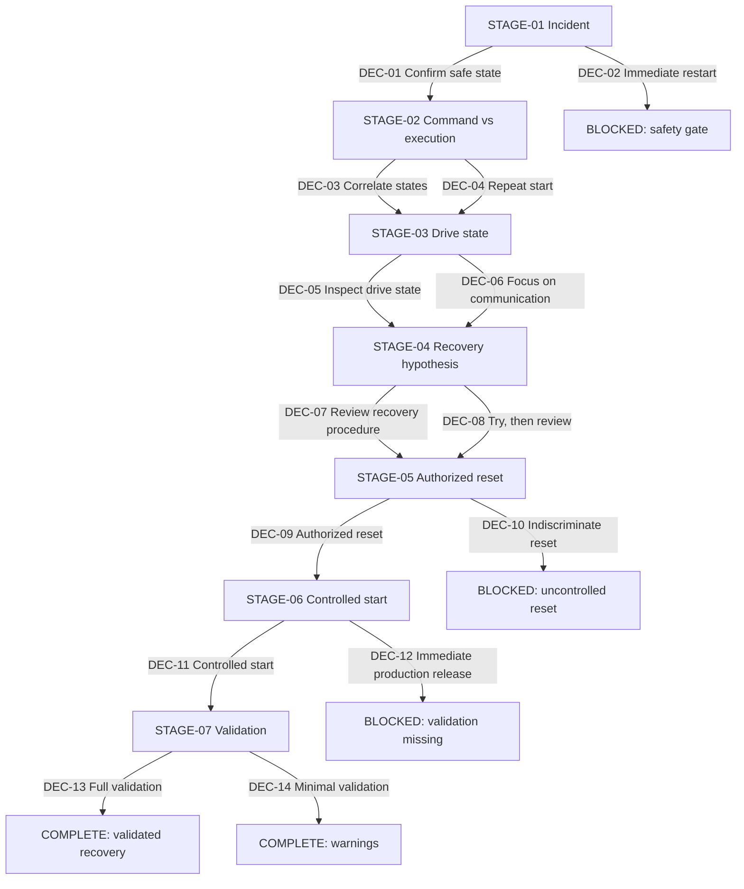

# Decision tree — Drive reset after emergency stop

**Experience:** `EXP-SIEMENS-DRIVE-002`

**Canonical source:** [`experience.yaml`](experience.yaml)

## Diagnostic tree



## Critical path

The strongest path is finite and contains one evidence-based action at every stage:

```text
DEC-01-CONFIRM-SAFE-STATE
→ DEC-03-CORRELATE-STATES
→ DEC-05-INSPECT-DRIVE-STATE
→ DEC-07-REVIEW-RECOVERY
→ DEC-09-AUTHORIZED-RESET
→ DEC-11-CONTROLLED-START
→ DEC-13-FULL-VALIDATION
→ COMPLETE
```

This path:

1. establishes the safety boundary;
2. proves the mismatch between command and movement;
3. distinguishes communication from drive readiness;
4. confirms the recovery gap;
5. performs an authorized reset;
6. verifies controlled movement;
7. validates repeatable and safe recovery before handover.

## Plausible weaker branches

- `DEC-04-REPEAT-START` consumes time because it repeats a command already present, but later comparison still recovers the diagnostic path.
- `DEC-06-FOCUS-COMMUNICATION` is technically plausible, yet poorly prioritized because no communication loss is known. It converges after communication and drive state are inspected.
- `DEC-08-TRY-THEN-REVIEW` remains controlled but delays the procedure comparison that directly tests the leading hypothesis.
- `DEC-14-MINIMAL-VALIDATION` recognizes restored movement but terminates with warnings because repeatability, safety validation, and handover evidence remain incomplete.

## Safety points

- `DEC-02-IMMEDIATE-RESTART` is blocked before any uncontrolled movement.
- `DEC-10-INDISCRIMINATE-RESET` is blocked because reset prerequisites, evidence preservation, and restart control are not satisfied.
- `DEC-12-RELEASE-IMMEDIATELY` is blocked because readiness is not equivalent to validated machine operation.

Unsafe paths never provide a positive score or safety effect.

## Completion criteria

Successful completion requires:

- confirmed safe intervention conditions;
- evidence that command and movement differ;
- communication and drive readiness inspection;
- confirmation of the incomplete recovery sequence;
- authorized reset;
- controlled movement;
- stop, restart, and safety validation;
- documented handover;
- safety score at or above the configured threshold.

Completion with warnings is possible only through the declared terminal decision `DEC-14-MINIMAL-VALIDATION`. It does not represent publication approval or full operational validation.
