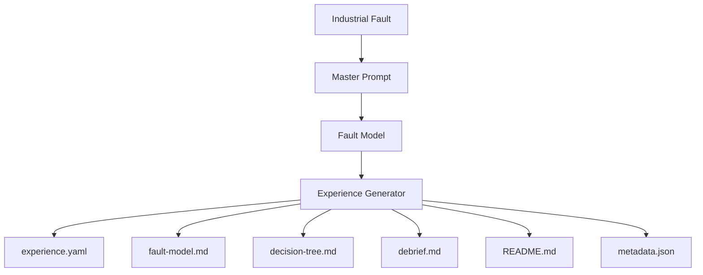

# Automatic Experience Generation Workflow

**Status:** Official  
**Owner:** Digital2Real Architect  
**Applies to:** Experience Engine generation, validation, and publication workflows

## Purpose

This workflow defines how Experience Engine transforms a verified industrial fault into a complete Digital2Real experience.

The workflow governs system architecture. It establishes:

- the minimum information required to begin generation;
- the order in which experience assets are derived;
- the responsibility of each generated asset;
- the validation gates required before publication;
- the boundaries between Experience Engine, Notebook, and the public web application.

Automation assists the authoring process. It does not replace technical review, pedagogical review, or publication approval.

`experience.yaml` is the structured source of truth. Every generated Markdown or JSON asset must be derived from it or validated against it.

## High-Level Workflow



The workflow has seven architectural phases:

1. capture a real or technically verified industrial fault;
2. normalize the minimum input through the Master Prompt;
3. establish a coherent private fault model;
4. generate the structured experience and its review assets;
5. validate consistency, safety, technical accuracy, and pedagogy;
6. connect reusable knowledge to Notebook without duplication;
7. publish approved assets to the web through an explicit integration boundary.

Generation must stop when the minimum input is incomplete, the causal chain is contradictory, or a safety-critical claim cannot be verified.

## Minimum Input

The Master Prompt must receive enough information to define the fault before narrative generation begins.

Required input:

- **competency:** the engineering capability the learner must demonstrate;
- **industrial context:** industry, process, machine or line, and operational state;
- **system boundary:** relevant controller, network, distributed I/O, drives, instrumentation, and supervisory systems;
- **initiating event:** the event that preceded or triggered the failure;
- **observable symptoms:** only what an operator or technician can initially observe;
- **root cause:** the physical, electrical, configuration, communication, or software condition to be corrected;
- **propagation:** how the root cause produced the observed symptoms;
- **operational impact:** production, quality, availability, or safety consequences;
- **intervention constraints:** safe-state, authorization, access, time, and production limitations;
- **recovery condition:** the condition that must be restored before functional validation;
- **validation criteria:** evidence required to confirm root cause, recovery, and safe production handover;
- **technical sources:** authoritative references for vendor-specific or safety-relevant claims.

Optional input:

- difficulty and expected duration;
- platform and domain classification;
- common weak interventions observed in practice;
- available diagrams, logs, alarms, or diagnostic captures;
- related Notebook knowledge;
- language and localization requirements.

Missing optional input may be proposed by the generator and marked for review. Missing required input must not be invented.

## Generated Assets

The generator produces one bounded experience package:

```text
experiences/<platform>/<experience-id>/
├── README.md
├── experience.yaml
├── fault-model.md
├── decision-tree.md
├── debrief.md
└── metadata.json
```

Each asset has one responsibility:

| Asset | Responsibility | Authority |
|---|---|---|
| `experience.yaml` | Structured scenario, stages, evidence, decisions, consequences, recovery, and validation | Canonical SSOT |
| `fault-model.md` | Human review of root cause, causal chain, symptoms, vulnerabilities, and recovery | Derived review asset |
| `decision-tree.md` | Human-readable diagnostic paths and their consequences | Derived review asset |
| `debrief.md` | Learner-facing explanation after completion | Derived publication asset |
| `README.md` | Package identity, competency, context, status, and review notes | Derived package overview |
| `metadata.json` | Machine-readable discovery and web-index projection | Derived integration asset |

`metadata.json` must contain only indexable fields derived from `experience.yaml`. It must not define stages, evidence, decisions, or validation logic independently.

Generated files begin in Draft status. Generation never implies publication approval.

## Fault Model Generation

Fault model generation occurs before learner-facing narrative generation.

The generator must separate:

- initiating event;
- root cause;
- propagation mechanism;
- symptoms;
- controller or system response;
- operational consequence;
- contributing vulnerabilities;
- immediate recovery;
- complete recovery;
- validation;
- recurrence prevention.

The causal chain must be expressible as:

```text
Trigger
→ technical failure
→ loss or degradation of function
→ control-system response
→ operational consequence
```

Every transition must be technically plausible. A symptom must never be promoted to root cause merely because it is visible.

The generated fault model must also identify uncertainty. Exact diagnostics, LED states, timing, messages, and vendor behavior require authoritative verification before publication.

## Evidence Generation

Evidence is generated from the fault model, not from the desired answer.

For each evidence item, the generator must define:

- evidence identifier;
- source or inspection action;
- observation revealed;
- stage at which it becomes available;
- reliability;
- diagnostic value;
- hypotheses strengthened;
- hypotheses weakened;
- time cost;
- operational risk;
- prerequisites;
- whether the action changes or destroys evidence.

Initial evidence must describe only information available without intervention.

Later evidence must be progressive. Each action should reduce, preserve, or increase uncertainty in a technically meaningful way. The root cause must not be revealed before the learner has a credible opportunity to reason toward it.

Conflicting evidence may be included only when the conflict is realistic and can be resolved through a valid diagnostic action.

## Decision Generation

Decisions are generated from the available evidence and intervention constraints at each stage.

Every decision must include:

- action;
- rationale;
- required evidence;
- immediate consequence;
- effect on uncertainty;
- effect on time and operational risk;
- safety effect;
- next stage or terminal state;
- feedback shown to the learner.

At least one option must represent the strongest evidence-based engineering action.

Alternative options must remain credible. Weak options may be premature, invasive, incomplete, symptom-oriented, unsupported by evidence, or temporarily effective without correcting the cause.

Unsafe actions must never receive a positive outcome. Where appropriate, they must be blocked by a safety gate rather than presented as ordinary scoring alternatives.

## Diagnostic Tree Generation

The diagnostic tree maps evidence and decisions into complete executable paths.

Each node must define:

- current stage;
- learner-visible context;
- evidence already available;
- decisions currently allowed;
- transition conditions;
- consequence;
- next node;
- completion, recovery, reassessment, or failure state.

The tree must support:

- one complete technically strong path;
- credible weak paths;
- reassessment after recoverable mistakes;
- safety-blocked transitions;
- temporary recovery that does not satisfy completion;
- convergence where different valid investigations produce equivalent evidence.

Every node and transition must have a stable identifier shared with `experience.yaml`.

The tree must be finite. Cycles are allowed only for explicit reassessment and must include a bounded exit condition. Unreachable nodes, transitions without destinations, and terminal states without debrief outcomes are invalid.

## Debrief Generation

The debrief is generated from the approved fault model and the learner's decision paths.

It must explain:

- root cause;
- causal chain;
- evidence hierarchy;
- strongest decisions and why they were strong;
- weak decisions and what made them weak;
- safe recovery sequence;
- functional validation and production handover;
- contributing vulnerabilities;
- prevention;
- reusable diagnostic pattern;
- related Notebook references.

The debrief must distinguish restarting equipment from completing the diagnosis.

It must not introduce facts absent from the fault model or contradict consequences defined in `experience.yaml`.

## Validation Rules

Generation is complete only when all applicable validation gates pass.

### Structural validation

- `experience.yaml` validates against `experience-schema.yaml`;
- required files exist;
- identifiers are unique and stable;
- all references resolve;
- the diagnostic tree has no unintended unreachable nodes;
- derived metadata agrees with the YAML source.

### Consistency validation

- the fault model, YAML, decision tree, README, and debrief describe the same root cause;
- evidence appears only after its defined acquisition action;
- decisions use only evidence available at their stage;
- consequences lead to valid destinations;
- completion conditions agree across all assets.

### Technical validation

- failure propagation is physically or logically plausible;
- diagnostic behavior and terminology are accurate;
- vendor-specific claims are supported by authoritative sources;
- corrective actions address the root cause;
- recovery and validation procedures are complete;
- unresolved uncertainty is explicit.

### Safety validation

- unsafe intervention is never rewarded;
- required isolation, authorization, and safe-state controls are represented;
- restart occurs only after required safety checks;
- production handover requires functional validation.

### Pedagogical validation

- the experience trains a defined competency;
- evidence is progressive;
- incorrect options are credible;
- consequences teach rather than merely punish;
- the learner must reason from evidence;
- the debrief extracts a transferable engineering method.

### Publication validation

- the complete correct path is playable;
- at least one weak path has been reviewed;
- all derived assets have been regenerated or reconciled after SSOT changes;
- technical and pedagogical reviewers approve the package;
- publication status is explicitly authorized.

Any failed gate returns the package to Draft.

## Integration with Notebook

Notebook owns reusable technical explanation. Experience Engine owns applied diagnostic judgement.

The generator may propose Notebook references when an experience depends on reusable knowledge such as:

- network identity;
- diagnostic buffer interpretation;
- sensor behavior;
- drive status words;
- safe restart patterns;
- measurement principles.

Integration rules:

- reference existing Notebook material instead of reproducing it;
- propose a missing Notebook topic as a separate editorial requirement;
- never create or modify a Notebook entry automatically during experience generation;
- keep Notebook identifiers and links in the structured experience;
- ensure the experience remains understandable without copying an entire article.

Notebook publication and Experience publication remain independent approval processes.

## Integration with Web

The public web application consumes only approved Experience Engine outputs through a dedicated integration boundary.

The web layer may consume:

- approved discovery metadata;
- learner-facing scenario and stage data;
- evidence available at the current state;
- permitted decisions;
- consequences and feedback;
- completion state;
- debrief content;
- Notebook references.

The web layer must not:

- infer root cause or decision logic independently;
- read private authoring notes;
- modify generated source assets;
- duplicate validation rules;
- publish Draft experiences;
- import generator internals into presentation code.

`metadata.json` may support indexing and discovery. Runtime experience behavior must come from validated structured data derived from `experience.yaml`.

Public integration requires its own implementation package and does not occur as a side effect of generation.

## Future Automation

Future automation may add:

- a governed Master Prompt template;
- schema-driven asset generation;
- deterministic regeneration of derived files;
- cross-file consistency checks;
- diagnostic-tree graph validation;
- duplicate fault-pattern detection;
- Notebook reference suggestions;
- terminology and localization checks;
- authoritative-source traceability;
- technical-review queues;
- web preview generation;
- publication packaging;
- regression tests for previously approved paths.

Future automation must preserve these boundaries:

- no speculative technical detail;
- no autonomous publication;
- no replacement of technical or pedagogical review;
- no second source of truth;
- no direct modification of Notebook;
- no coupling between generation tools and public presentation;
- no vendor lock-in in the core generation model.

Automation should reduce repetitive authoring work while keeping engineering judgement, safety, and approval explicitly human-governed.
